## 3. 当前版本具体设计（按 Agent Plan 可拆分结构）

### 3.1 本章目标与阅读方式

本章按“可拆分 agent plan 模块”重排，不再按散点能力堆叠。每个模块都用同一结构表达：
1. 职责边界（负责什么，不负责什么）。
2. 输入合同（最小必填语义）。
3. 处理规则（必须冻结的决策逻辑）。
4. 输出合同（下一模块可直接消费）。
5. 审计与版本锚点（可回放、可治理）。
6. 当前版本仅冻结 MVP 必需项；详细设计统一后置到第 5 章索引，不在本章展开。

### 3.2 模块链路总览（Execution Graph）

当前版本执行链路固定为：
1. `Module A: SDK Ingress & Opportunity Sensing`
2. `Module B: Schema Translation & Signal Normalization`
3. `Module C: Policy & Safety Governor`
4. `Module D: Supply Orchestrator & Adapter Layer`
5. `Module E: Delivery Composer`
6. `Module F: Event & Attribution Processor`
7. `Module G: Audit & Replay Controller`
8. `Module H: Config & Version Governance`（横切，不在单一节点执行）

链路原则：
1. 同步主链只保证 `Request -> Delivery`。
2. 异步侧链负责 `Event -> Archive`。
3. 主链与侧链通过 `responseReference` 关联。
4. 所有关键决策点必须可审计、可回放、可版本定位。

#### 3.2.1 整体框架：Mediation 与 Ads Network 交互（推荐先看）

边界定义：
1. `Mediation` 负责：机会识别、统一 schema、策略门禁、供给编排、统一 Delivery、事件闭环、审计回放。
2. `Ads Network` 负责：网络侧请求接入、拍卖/竞价、DSP 请求分发、候选结果返回。
3. 当前版本里，`Module D (Supply Orchestrator + Adapter)` 承担连接 Ads Network 的网关职责。
4. 未来向 SSP 过渡时，可把 `Module D` 内部进一步拆成交易子模块（请求、拍卖结果、结算对账）。

请求来回与数据职责：
1. Mediation -> Ads Network：发送标准化机会请求（network bid request）。
2. Ads Network -> Mediation：返回候选结果/无填充/错误（source response）。
3. Mediation -> App：输出 Delivery（`served/no_fill/error + responseReference`）。
4. App -> Mediation：回传 Event（`impression/click/failure`）。
5. Mediation（可选）-> Ads Network：回传归因/结果确认（按网络能力）。
6. 闭环完成判定在 Mediation 内部：`Delivery + terminal Event` 关联后归档。
7. Mediation 主链内部顺序固定为：`Module A -> Module B -> Module C -> Module D -> Module E`。

```mermaid
flowchart LR
    subgraph APP["Application Layer"]
        APP_REQ["App SDK Request"]
        APP_DEL["App Receives Delivery"]
        APP_EVT["App Event Callback"]
    end

    subgraph MED["Our Product: Mediation"]
        A["A SDK Ingress + Opportunity Sensing"]
        B["B Schema Translation + Signal Normalization"]
        C["C Policy + Safety Governor"]
        D["D Supply Orchestrator + Adapter"]
        E["E Delivery Composer"]
        F["F Event Processor"]
        LOOP{"Loop Complete?<br/>Delivery + Terminal Event"}
        TO["Write failure(timeout)"]
        AR["Archive"]
        G["Audit/Replay"]
    end

    subgraph NET["Ads Network Layer"]
        NG["Network Gateway"]
        AX["SSP/Exchange Auction"]
        DSP["DSP Bidders"]
    end

    APP_REQ -->|Opportunity Request| A
    A -->|Opportunity Seed| B
    B -->|Unified Opportunity Schema| C
    C -->|Routable Opportunity| D
    C -->|Policy blocked result| E

    D -->|Network Bid Request| NG
    NG -->|Auction Request| AX
    AX -->|Bid Request| DSP
    DSP -->|Bid Response| AX
    AX -->|Auction Result| NG
    NG -->|Source Response| D

    D -->|Normalized Candidate| E
    E -->|Delivery Response + responseReference| APP_DEL
    APP_DEL -->|User/Agent interaction outcome| APP_EVT

    APP_EVT -->|impression/click/failure + responseReference| F
    F --> LOOP
    LOOP -->|yes| AR
    LOOP -->|timeout/no terminal event| TO
    TO --> AR

    F -. optional attribution callback .-> NG
    AR --> G
```

一句话理解：
1. Ads Network 给的是供给结果，Mediation 给 App 的是统一交付结果（Delivery）。
2. Delivery 不是闭环终点；闭环终点是 Event 到达并与 Delivery 关联后归档。
3. 审计层负责把 Mapping/Routing/Delivery/Event 串成可回放证据链。

