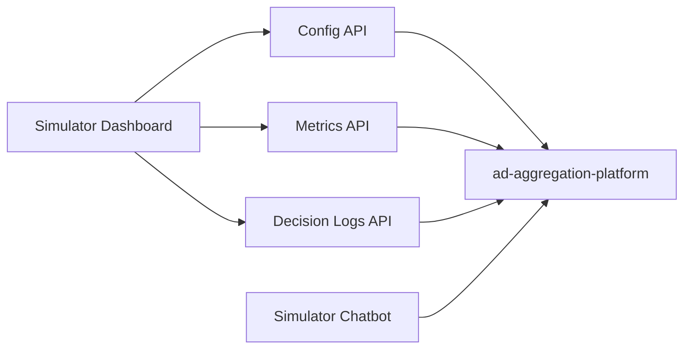

# Developer Dashboard Project Plan (Draft)

- Version: v0.1
- Last Updated: 2026-02-17
- Goal: 为 SDK 接入方提供统一管理后台（收益查看 + 配置管理 + 决策可观测）

## 1. 背景与定位

当前我们已有：

1. 广告聚合平台协议与运行时（`projects/ad-aggregation-platform`）。
2. Chatbot 模拟容器（`projects/simulator-chatbot`）。

缺口在于：缺少一个“应用方视角”的控制台，无法让接入方在一个后台完成以下动作：

1. 查看收益和效果指标。
2. 管理 placement 开关与触发参数。
3. 回看每次广告触发决策（为什么触发/不触发）。

## 2. 产品目标

## 2.1 一期（MVP）

1. 提供收益总览（impression/click/revenue/eCPM）。
2. 提供 Placement 配置页（启用状态、优先级、频控）。
3. 提供 Trigger 配置页（intent threshold、cooldown、收益阈值）。
4. 提供 Decision Logs（含 no-fill / blocked 的原因字段）。

## 2.2 二期

1. 增加 A/B 实验配置（参数版本管理）。
2. 增加分租户/分应用权限模型（RBAC）。
3. 增加告警（收益异常、填充率骤降、触发失败率上升）。

## 3. 项目拆分建议

推荐新增第三个子项目：`projects/simulator-dashboard`。

边界建议：

1. `ad-aggregation-platform` 负责配置与决策 API。
2. `simulator-dashboard` 负责可视化管理与操作。
3. `simulator-chatbot` 继续作为最终用户视角的体验验证容器。

## 4. 系统架构（建议）

## 5. 数据接口建议（MVP）

## 5.1 Placement Config API

1. `GET /api/v1/dashboard/placements`
2. `PUT /api/v1/dashboard/placements/:placementId`

返回字段至少包括：

1. `placementId`
2. `enabled`
3. `priority`
4. `surface`
5. `format`
6. `trigger.intentThreshold`
7. `trigger.cooldownSeconds`
8. `frequencyCap.maxPerSession`
9. `frequencyCap.maxPerUserPerDay`

## 5.2 Metrics API

1. `GET /api/v1/dashboard/metrics/summary?from=...&to=...`
2. `GET /api/v1/dashboard/metrics/by-placement?from=...&to=...`

关键指标：

1. `impressions`
2. `clicks`
3. `ctr`
4. `revenue`
5. `ecpm`
6. `fillRate`

## 5.3 Decision Log API

1. `GET /api/v1/dashboard/decisions?placementId=...&result=...`

关键字段：

1. `requestId`
2. `placementId`
3. `intentScore`
4. `result` (`served|blocked|no_fill`)
5. `reason` (`intent_below_threshold|cooldown|frequency_cap|blocked_topic|no_offer`)
6. `createdAt`

## 6. 前端信息架构（MVP）

1. `Overview`
- KPI cards（revenue, CTR, fill rate）
- 收益趋势图（可先用 mock 曲线）

2. `Placements`
- placement 列表
- enabled 开关
- priority 和频控设置

3. `Triggers`
- intentThreshold / cooldown / minExpectedRevenue
- “参数由用户自定义”模式说明与默认建议

4. `Decision Logs`
- 最近触发日志
- 支持按 placement 和 result 筛选

## 7. 研发节奏建议

1. Milestone 1（2-3 天）
- 完成 `simulator-dashboard` 前端骨架与本地 mock 数据。
- 完成 UI 结构和表单交互。

2. Milestone 2（3-5 天）
- 在 `ad-aggregation-platform` 新增 dashboard 只读 API。
- Dashboard 接入真实读取（仍可 mock 写入）。

3. Milestone 3（3-5 天）
- 完成配置保存 API（含 schema 校验）。
- 增加 decision log 展示与筛选。

4. Milestone 4（后续）
- 加权限、告警、AB 实验和变更审计。

## 8. 风险与控制

1. 风险：参数完全开放导致策略失控。
- 建议：参数由用户自定义，但平台提供 guardrail（最小/最大值）。

2. 风险：调参后收益波动难定位。
- 建议：每次配置变更记录版本号与变更人，支持回滚。

3. 风险：无触发日志无法解释效果。
- 建议：决策链路统一输出 `reason` 枚举并在 Dashboard 展示。

## 9. 你现在可以直接拍板的事项

1. 是否确认新增 `projects/simulator-dashboard` 作为独立项目。
2. MVP 是否先只支持 `attach` 与 `next_step` 两层配置。
3. 是否把参数编辑权限默认开给租户管理员（而不是普通成员）。

