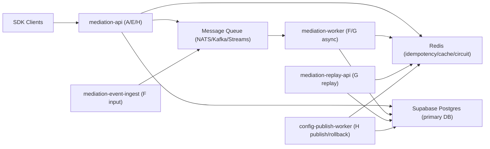

# Infra Topology and Capacity Baseline (INFRA-001)

- Date: 2026-02-21
- Scope: Mediation production baseline
- Primary DB backend: Supabase Postgres (`project_ref=bkqjenmznafkqqwvwrad`)

## 1. Production Topology (MVP)

## 2. Service Responsibilities

1. `mediation-api`
   - Sync request path (`Request -> Delivery`), config read path (`GET /config`), publish trigger path.
2. `mediation-event-ingest`
   - Accepts `POST /events`, validates envelope, pushes normalized events to MQ.
3. `mediation-worker`
   - Idempotent event processing, attribution, archive write, retry/dead-letter handling.
4. `mediation-replay-api`
   - `replay(opportunity_key | time_range)` with deterministic snapshot/rule-recompute modes.
5. `config-publish-worker`
   - H publish state machine, rollout, rollback, failure compensation.

## 3. Supabase as Primary Postgres

1. Supabase is the production source-of-truth relational store for:
   - Config snapshots/publish operations
   - Opportunity/delivery/event/archive/audit/replay records
2. Runtime app should connect with:
   - `SUPABASE_DB_URL` (preferred) or `DATABASE_URL` (fallback alias)
3. MCP is the operational control-plane integration for development workflows.
4. No local Postgres is required for normal dev when Supabase DB URL is available.

## 4. Baseline Traffic Model

Assumptions for initial production:

1. Peak sync request rate: `200 RPS`
2. Avg sync request rate: `50 RPS`
3. Avg events per request: `1.8`
4. Peak event ingest rate: `360 TPS` (burst target `600 TPS`)
5. Replay requests: `< 5 RPS` normal, `< 20 RPS` during disputes

Derived daily volume (initial):

1. Requests/day: `~4.32M` (at 50 RPS average)
2. Events/day: `~7.78M`
3. Archive records/day: `~4.32M` (1 terminal closure per request expected)

## 5. Storage Growth Baseline

Estimated per-row payload (compressed JSON + indexed columns):

1. `opportunity_records`: `2.0 KB`
2. `delivery_records`: `1.5 KB`
3. `event_records`: `1.2 KB`
4. `archive_records`: `2.5 KB`
5. `audit_records`: `3.0 KB`

Estimated growth/day (rough order):

1. Opportunity + delivery: `~15 GB/day`
2. Event + archive: `~20 GB/day`
3. Audit/replay metadata: `~8 GB/day`
4. Total hot data: `~43 GB/day` (before retention/partitioning optimization)

## 6. Scaling Triggers

Trigger thresholds (must trigger scale plan):

1. Sync request p95 latency > `300ms` for 15 min
2. MQ consumer lag > `5 min` sustained
3. Event ACK success < `99.9%` for 10 min
4. Supabase DB CPU > `70%` sustained 15 min
5. Redis memory > `75%` sustained 15 min

Immediate actions:

1. Increase worker concurrency
2. Increase queue partitions/consumer groups
3. Reduce replay concurrency / throttle non-critical traffic
4. Enable temporary degradation profiles from H rollout policy

## 7. Retention and Data Tiering

1. Hot relational data: `30 days`
2. Warm relational/partitioned data: `180 days`
3. Cold archive in object storage: `>= 365 days` (policy dependent)
4. Replay must remain deterministic for all retained dispute windows.

## 8. Go/No-Go Infra Gate (MVP)

Must be true before production go-live:

1. Supabase DB connectivity + migration baseline passed.
2. Redis + MQ health checks passed.
3. End-to-end closure path validated under peak simulation.
4. Alerting and oncall routing enabled for P0/P1 conditions.
5. Rollback playbook tested at least once in preprod.

