# Mediation 模块设计文档（当前版本）

- 文档版本：v2.3
- 最近更新：2026-02-21
- 文档类型：Design Doc（策略分析 + 具体设计 + 演进规划）
- 当前焦点：当前版本（接入与适配基线）

## 0. 文档定位（Metadata）

本文件同时承载三层信息：
1. 策略与上下文：为什么现在要这么做。
2. 当前版本具体设计：现在到底怎么做。
3. 未来规划：优化项与 SSP 过渡怎么走。

### 0.1 关联文档

1. AI Assistant Placement Framework：`/Users/zeming/Documents/chat-ads-main/docs/ai-assistant-placement-framework.md`

## 1. 模块使命与边界

### 1.1 模块使命

Mediation 的核心使命：
1. 让 AI 应用低成本、低摩擦接入广告网络。
2. 在兼容现有生态前提下，输出更高质量机会。
3. 为后续 SSP 化沉淀标准与能力资产。

### 1.2 模块边界

Mediation 负责：
1. 标准接入框架设计。
2. 外部输入到内部统一模型映射。
3. 多供给源适配与统一回传语义。
4. 基础 placement 编排与路由。
5. 请求-事件闭环基础能力。

Mediation 当前不负责：
1. 完整 SSP 交易层。
2. 完整 DSP 决策层。
3. 高复杂竞价与全量风控。

## 2. 策略层与关键 Context

### 2.1 当前 Context

1. 冷启动阶段，应用方与广告商数量有限。
2. 早期难以直接规模接入 DSP 与大型 Ads Network。
3. 现阶段供给以广告联盟 + 模拟广告库为主。

### 2.2 为什么是 Mediation First

1. 先解决“接得上、跑得通”。
2. 用统一模型避免后续 SSP 阶段返工。
3. 先做稳定闭环，再扩展复杂能力。

### 2.3 Fundamental Design Principles

1. 单入口：应用只接 Mediation。
2. 单模型：外部输入统一到内部机会模型。
3. 单语义：对应用输出统一响应语义。
4. 双链路：请求同步、事件异步，主链路 fail-open。
5. 可演进：结构必须可平滑升级到 SSP 能力。

## 3. 当前版本具体设计（按 Agent Plan 可拆分结构）

### 3.1 本章目标与阅读方式

本章按“可拆分 agent plan 模块”重排，不再按散点能力堆叠。每个模块都用同一结构表达：
1. 职责边界（负责什么，不负责什么）。
2. 输入合同（最小必填语义）。
3. 处理规则（必须冻结的决策逻辑）。
4. 输出合同（下一模块可直接消费）。
5. 审计与版本锚点（可回放、可治理）。

### 3.2 模块链路总览（Execution Graph）

当前版本执行链路固定为：
1. `Module A: SDK Ingress & Opportunity Sensing`
2. `Module B: Schema Translation & Signal Normalization`
3. `Module C: Policy & Safety Governor`
4. `Module D: Supply Orchestrator & Adapter Layer`
5. `Module E: Delivery Composer`
6. `Module F: Event & Attribution Processor`
7. `Module G: Audit & Replay Controller`
8. `Module H: Config & Version Governance`（横切，不在单一节点执行）

链路原则：
1. 同步主链只保证 `Request -> Delivery`。
2. 异步侧链负责 `Event -> Archive`。
3. 主链与侧链通过 `responseReference` 关联。
4. 所有关键决策点必须可审计、可回放、可版本定位。

#### 3.2.1 整体框架：Mediation 与 Ads Network 交互（推荐先看）

边界定义：
1. `Mediation` 负责：机会识别、统一 schema、策略门禁、供给编排、统一 Delivery、事件闭环、审计回放。
2. `Ads Network` 负责：网络侧请求接入、拍卖/竞价、DSP 请求分发、候选结果返回。
3. 当前版本里，`Module D (Supply Orchestrator + Adapter)` 承担连接 Ads Network 的网关职责。
4. 未来向 SSP 过渡时，可把 `Module D` 内部进一步拆成交易子模块（请求、拍卖结果、结算对账）。

请求来回与数据职责：
1. Mediation -> Ads Network：发送标准化机会请求（network bid request）。
2. Ads Network -> Mediation：返回候选结果/无填充/错误（source response）。
3. Mediation -> App：输出 Delivery（`served/no_fill/error + responseReference`）。
4. App -> Mediation：回传 Event（`impression/click/failure`）。
5. Mediation（可选）-> Ads Network：回传归因/结果确认（按网络能力）。
6. 闭环完成判定在 Mediation 内部：`Delivery + terminal Event` 关联后归档。
7. Mediation 主链内部顺序固定为：`Module A -> Module B -> Module C -> Module D -> Module E`。

```mermaid
flowchart LR
    subgraph APP["Application Layer"]
        APP_REQ["App SDK Request"]
        APP_DEL["App Receives Delivery"]
        APP_EVT["App Event Callback"]
    end

    subgraph MED["Our Product: Mediation"]
        A["A SDK Ingress + Opportunity Sensing"]
        B["B Schema Translation + Signal Normalization"]
        C["C Policy + Safety Governor"]
        D["D Supply Orchestrator + Adapter"]
        E["E Delivery Composer"]
        F["F Event Processor"]
        LOOP{"Loop Complete?<br/>Delivery + Terminal Event"}
        TO["Write failure(timeout)"]
        AR["Archive"]
        G["Audit/Replay"]
    end

    subgraph NET["Ads Network Layer"]
        NG["Network Gateway"]
        AX["SSP/Exchange Auction"]
        DSP["DSP Bidders"]
    end

    APP_REQ -->|Opportunity Request| A
    A -->|Opportunity Seed| B
    B -->|Unified Opportunity Schema| C
    C -->|Routable Opportunity| D
    C -->|Policy blocked result| E

    D -->|Network Bid Request| NG
    NG -->|Auction Request| AX
    AX -->|Bid Request| DSP
    DSP -->|Bid Response| AX
    AX -->|Auction Result| NG
    NG -->|Source Response| D

    D -->|Normalized Candidate| E
    E -->|Delivery Response + responseReference| APP_DEL
    APP_DEL -->|User/Agent interaction outcome| APP_EVT

    APP_EVT -->|impression/click/failure + responseReference| F
    F --> LOOP
    LOOP -->|yes| AR
    LOOP -->|timeout/no terminal event| TO
    TO --> AR

    F -. optional attribution callback .-> NG
    AR --> G
```

一句话理解：
1. Ads Network 给的是供给结果，Mediation 给 App 的是统一交付结果（Delivery）。
2. Delivery 不是闭环终点；闭环终点是 Event 到达并与 Delivery 关联后归档。
3. 审计层负责把 Mapping/Routing/Delivery/Event 串成可回放证据链。

### 3.3 Module A: SDK Ingress & Opportunity Sensing

#### 3.3.1 职责边界

1. 承接 SDK 请求入口并做基础规范化。
2. 识别当前对话/任务中是否存在广告机会（opportunity sensing）。
3. 生成机会种子对象，交给下游做标准化翻译。

不负责：
1. 交易级路由决策。
2. 最终 Delivery 组装。
3. 事件归因与结算逻辑。

#### 3.3.2 输入合同（最小）

1. 应用与会话基础信息。
2. placement 触发信息（与 `/Users/zeming/Documents/chat-ads-main/docs/ai-assistant-placement-framework.md` 对齐）。
3. 请求时间与接入通道。
4. 最小追踪上下文（trace key 初始化所需）。

#### 3.3.3 处理规则

1. 统一入口接收后先做输入校验，再进入机会识别。
2. 缺失非关键字段时受控降级，不阻断主链路。
3. 机会识别结果必须给出确定状态：命中机会 / 未命中机会 / 受策略阻断。

#### 3.3.4 输出合同

1. 机会种子对象（状态初始为 `received`）。
2. 机会触发解释摘要（用于审计与排障）。
3. 追踪主键与请求级时间戳。

### 3.4 Module B: Schema Translation & Signal Normalization

#### 3.4.1 统一 Opportunity Schema（共同语言）

当前版本冻结六块骨架：
1. `RequestMeta`
2. `PlacementMeta`
3. `UserContext`
4. `OpportunityContext`
5. `PolicyContext`
6. `TraceContext`

冻结方式：
1. 每块区分 required / optional。
2. 新能力优先放 optional，不破坏主语义。
3. 顶层冻结 `schemaVersion` 与 `state`。

#### 3.4.2 状态机（冻结）

`state` 固定枚举：
1. `received`
2. `routed`
3. `served`
4. `no_fill`
5. `error`

迁移约束：
1. 起始必须 `received`。
2. 终态必须为 `served/no_fill/error` 之一。
3. 任一迁移必须记录时间戳、原因码、规则版本。

#### 3.4.3 外部输入映射与冲突优先级

映射原则：
1. 先映射后决策。
2. 枚举必须归一后才可进入内部模型。
3. 同请求同规则版本下结果必须确定性一致。

冲突优先级（高 -> 低）：
1. `App Explicit`
2. `Placement Config`
3. `Default Policy`

冲突记录要求（每个语义位点）：
1. 原值（raw value）。
2. 归一值（normalized value）。
3. 冲突动作与原因码。
4. 生效规则版本。

#### 3.4.4 旧 SSP 与新增 AI 信号对齐

1. 必兼容旧 SSP 基础语义：请求、placement、环境、响应/回传基础口径。
2. 当前增量 AI 信号：workflow 阶段、human/agent 主体、意图快照、任务上下文。
3. 对外不支持的新信号先内部沉淀，不破坏现有兼容性。

#### 3.4.5 输出合同

1. 可交易的统一机会对象（SSP-like request profile 基底）。
2. 映射审计记录（支持回放）。
3. 下游可直接消费的标准枚举与状态。

### 3.5 Module C: Policy & Safety Governor

#### 3.5.1 职责边界

1. 对统一机会对象做合规、频控、敏感类目与授权范围审查。
2. 给出“可路由”或“受控拦截”结论。
3. 作为路由前置门禁，防止不合规请求进入供给层。

#### 3.5.2 处理规则

1. 强约束命中时允许 fail-closed。
2. 弱约束命中时标记风险并进入受控降级。
3. 所有拦截与放行动作必须输出标准原因码。

#### 3.5.3 输出合同

1. `routable opportunity` 或 `policy-blocked result`。
2. 策略命中轨迹（用于审计与回放）。

### 3.6 Module D: Supply Orchestrator & Adapter Layer

#### 3.6.1 供给范围（当前最小）

1. 广告联盟供给源。
2. 模拟广告库供给源。

#### 3.6.2 Supply Adapter 标准合同（冻结）

每个 adapter 至少实现四件事：
1. `request adapt`
2. `candidate normalize`
3. `error normalize`
4. `source trace`

边界约束：
1. 私有字段只能进 `extensions`。
2. `extensions` 不得污染主语义与核心口径。

#### 3.6.3 路由与降级模型（规则 DAG）

1. 当前版本固定规则 DAG，不引入复杂优化器。
2. 路由顺序固定：`Primary -> Secondary -> Fallback`。
3. 每次切换必须记录原因：`no_fill/timeout/error/policy_block`。

超时与状态：
1. 超时触发下一路由，不阻塞主链路。
2. `no_fill` 为正常无候选。
3. `error` 为处理异常（可重试/不可重试分类）。

可用性边界：
1. 默认 fail-open。
2. 强策略场景允许 fail-closed。

#### 3.6.4 输出合同

1. 标准候选结果集合或空结果。
2. 路由轨迹与降级轨迹。
3. 状态更新（进入 `routed` 并最终走向终态）。

### 3.7 Module E: Delivery Composer

#### 3.7.1 Delivery Schema 职责

1. 只描述“本次返回”。
2. 不承载后续行为事件语义。
3. 输出必须对齐 placement 展示约束与 fail-open 策略。

#### 3.7.2 Delivery / Event 分离（核心冻结）

1. `Delivery Schema`：同步返回对象。
2. `Event Callback Schema`：异步行为对象。
3. 两者只通过 `responseReference` 关联，不相互复制负载。

#### 3.7.3 输出合同

1. 返回状态：`served` / `no_fill` / `error`。
2. `responseReference`（必填）。
3. 可被下游事件与审计直接关联的最小返回快照。

### 3.8 Module F: Event & Attribution Processor

#### 3.8.1 事件合同（当前最小集）

事件最小集冻结：
1. `impression`
2. `click`
3. `failure`

必填语义：
1. `responseReference`
2. 事件类型
3. 事件时间
4. 状态与原因码（适用时）

#### 3.8.2 处理规则

1. 事件必须先归一再归因。
2. 无 `responseReference` 事件进入隔离轨道，不进标准口径。
3. 事件窗口超时时系统补写 `failure` 终态，保证闭环可完成。

#### 3.8.3 输出合同

1. 事件归一记录与关联结果。
2. 闭环终态更新信号。

### 3.9 Module G: Audit & Replay Controller

#### 3.9.1 审计单元

最小审计单元固定为“单机会对象”，必须贯穿全生命周期。

#### 3.9.2 四段关键决策点（冻结）

1. `Mapping`
2. `Routing`
3. `Delivery`
4. `Event`

每段最小字段：
1. 决策类型
2. 时间戳与耗时
3. 输入摘要与输出摘要
4. 状态与原因码
5. 规则版本
6. 关联键（trace key + `responseReference`）

#### 3.9.3 回放基线

1. 支持按 `responseReference` 或 trace key 回放单请求全链路。
2. 回放覆盖 `Request -> Mapping -> Routing -> Delivery -> Event -> Archive`。
3. 审计写入失败不得阻塞主链路，走异步补偿。

### 3.10 Module H: Config & Version Governance（横切模块）

#### 3.10.1 三条版本线分离（冻结）

1. `Schema Version`
2. `Routing Strategy Version`
3. `Placement Config Version`

治理规则：
1. 三线独立发布、独立回滚、独立审计。
2. 任一线升级不得隐式修改其他两线行为。
3. 单请求必须记录三线版本快照。

#### 3.10.2 兼容与回滚

1. schema 变更优先 optional 扩展，破坏兼容才升主版本。
2. 路由策略先灰度再放量，监控 `served/no_fill/error` 与延迟。
3. 回滚顺序按最小影响面：placement -> routing -> schema。

### 3.11 数据闭环模型（Request -> Delivery -> Event -> Archive）

#### 3.11.1 闭环完成条件（冻结）

1. 存在有效 Delivery（`served/no_fill/error`）。
2. 存在终态 Event（当前最小集：`impression/click/failure`）。
3. 二者通过同一 `responseReference` 关联。
4. 窗口超时时系统补写 `failure` 完成闭环。

#### 3.11.2 闭环价值

1. 支撑优化策略验证与质量评估。
2. 支撑对账、审计与争议回放。
3. 作为向 SSP 过渡的数据资产底座。

### 3.12 最小输入接入指南与最小链路清单

#### 3.12.1 SDK 最小接入指南

1. 注册应用与 placement 基础信息。
2. 接入同步请求入口（Delivery）。
3. 接入异步事件回传入口（Event Callback）。
4. 完成联调检查（状态机、追踪、回传关联）。
5. 完成发布检查（灰度配置、回滚预案、审计可见性）。

#### 3.12.2 当前版本最小链路清单

请求链路（同步）：
1. 统一入口接收。
2. 机会识别。
3. schema 翻译与映射归一。
4. 策略门禁。
5. 供给路由与候选归一。
6. Delivery 返回。

事件链路（异步）：
1. impression/click/failure 上报。
2. 事件归一与归因关联。
3. 归档写入与审计回放。
4. 闭环终态确认。

### 3.13 Agent Plan 拆分建议（直接可执行）

为后续拆分具体 agent plan，建议以模块为单位立项，每个 plan 至少包含：目标、输入合同、输出合同、规则版本、审计点、验收标准。

1. Plan-A：`SDK Ingress & Opportunity Sensing`
2. Plan-B：`Schema Translation & Signal Normalization`
3. Plan-C：`Policy & Safety Governor`
4. Plan-D：`Supply Orchestrator & Adapter Layer`
5. Plan-E：`Delivery Composer`
6. Plan-F：`Event & Attribution Processor`
7. Plan-G：`Audit & Replay Controller`
8. Plan-H：`Config & Version Governance`

## 4. 当前版本交付包（Deliverables）

1. 标准接入框架说明。
2. 统一机会建模 Schema 说明。
3. 外部输入映射规则说明。
4. 两类供给适配说明。
5. 回传 Schema 边界说明（Delivery vs Event Callback）。
6. 数据闭环说明。
7. 旧 SSP vs 新 AI 内容边界说明。
8. 最小接入指南与最小链路清单。
9. 联调与发布检查清单。
10. 路由与降级策略模型说明（规则 DAG + fallback 顺序 + 阈值策略）。
11. 可观测与审计模型说明（单机会对象 + 四段关键决策点）。
12. 配置与版本治理说明（三线分离：schema/route/placement）。
13. Agent Plan 模块框架说明（A-H 模块链路）。
14. 模块化链路说明（SDK 接入与机会识别 -> SSP-like 关键信息构建）。
15. Mediation 与 Ads Network 交互边界与流程图说明。

## 5. 优化项与 SSP 过渡（Plan）

### 5.1 优化项：编排与路由扩展

1. 扩展 placement 类型与场景覆盖。
2. 扩展供给路由和回退策略。
3. 在不破坏当前版本标准前提下提升匹配效率。

### 5.2 优化项：返回与回传能力增强

1. 扩展回传事件体系与追踪能力。
2. 强化可观测与审计体系。
3. 为 SSP 过渡准备更完整信号输出结构。

### 5.3 标准化交易接口与 SSP 过渡

1. 把当前稳定能力模块化产品化。
2. 将流量质量、机会分析、意图识别、用户建模逐步升级到 SSP 能力。

#### 5.3.1 标准化交易接口目标（SSP Transition）

1. 将当前 Mediation 的“机会编排接口”升级为“可交易接口”。
2. 对外提供可被 DSP/Ads Network 稳定消费的标准请求、标准回传、标准结算语义。
3. 在兼容旧 SSP 输入标准的同时，输出 AI 场景增量信号，形成差异化质量资产。

#### 5.3.2 交易接口分层（建议标准）

向 SSP 过渡时，接口建议拆成六层并独立版本化：

1. `Bid Opportunity Interface`（请求接口）：
   - 表达可交易机会、上下文、策略约束、时延预算。
2. `Bid Decision Interface`（响应接口）：
   - 表达出价、素材候选、有效期、响应状态与拒绝原因。
3. `Auction Result Interface`（结果通知接口）：
   - 表达中标/未中标、价格结果、清算依据、结果时间。
4. `Delivery Callback Interface`（交付回传接口）：
   - 表达交付状态与展示确认，不承载行为转化语义。
5. `Event Callback Interface`（行为事件接口）：
   - 表达 `impression/click/failure` 最小闭环事件及扩展事件。
6. `Settlement & Reconciliation Interface`（结算对账接口）：
   - 表达账单口径、分润规则、对账批次、差异处理状态。

#### 5.3.3 信息采集层面需要补充的关键项

当前版本已有基础闭环，但向 SSP 过渡仍需补强以下采集维度：

1. 交易上下文信号：
   - `auction_type`、`pricing_model`、`currency`、`floor_policy_snapshot`、`timeout_budget`。
2. 供给路径信号：
   - `source_path`、`adapter_hop`、`fallback_path`、`path_latency_breakdown`。
3. 质量与可见性信号：
   - `view_opportunity_level`、`placement_quality_tier`、`traffic_quality_flags`。
4. 交互与任务信号：
   - `workflow_stage`、`agent_or_human_actor`、`intent_confidence_band`。
5. 结算与对账信号：
   - `settlement_reference`、`billing_scope`、`reconciliation_batch_id`、`dispute_reason`。
6. 合规与授权信号：
   - `consent_scope`、`policy_decision_code`、`restricted_category_flags`。

#### 5.3.4 Schema 层面增补建议（按六块模型）

保持六块统一模型不变，向 SSP 过渡时以“子结构扩展 + optional 字段”方式增强：

1. `RequestMeta` 增补：
   - `transactionContext`（auction/pricing/currency/timeout）。
   - `requestSLA`（tmax、重试预算、降级预算）。
2. `PlacementMeta` 增补：
   - `placementQualityProfile`（quality tier、view opportunity、历史稳定性）。
   - `commercialConstraintProfile`（频控档位、展示密度约束）。
3. `UserContext` 增补：
   - `interactionRole`（human/agent/agent-chain）。
   - `sessionIntentWindow`（多轮意图窗口摘要与置信区间）。
4. `OpportunityContext` 增补：
   - `marketabilitySignals`（可交易性标签、推荐可解释信号）。
   - `executionStageSignals`（任务执行阶段与转化窗口）。
5. `PolicyContext` 增补：
   - `complianceSnapshot`（授权范围、敏感类目策略快照）。
   - `pricingGuardrail`（价格底线策略与策略命中原因）。
6. `TraceContext` 增补：
   - `auctionReference`、`settlementReference`、`reconciliationReference`。
   - `decisionLineage`（映射/路由/拍卖/结算的版本链路）。

#### 5.3.5 当前缺口识别（Collection + Schema）

1. 缺少交易级上下文快照：
   - 当前侧重机会与回传，交易参数采集不完整。
2. 缺少供给路径可解释性：
   - 现有 trace 可回放，但未标准化供给路径拆分指标。
3. 缺少结算级关联键：
   - 已有 `responseReference`，但结算/对账 reference 尚未纳入标准最小集。
4. 缺少质量分层标准：
   - 已有策略与路由，但缺统一的 `placement quality tier` 与 view-opportunity 档位。
5. 缺少接口层分离：
   - Delivery/Event 已分离，但交易结果通知与结算接口仍需单独标准化。

#### 5.3.6 演进落地顺序（建议）

1. Step A（采集与 schema 增强）：
   - 先补齐交易上下文采集与 schema optional 增量，不改变对外兼容。
2. Step B（交易接口灰度）：
   - 引入 `Auction Result Interface` 与 `Settlement/Reconciliation Interface` 草案并灰度。
3. Step C（质量标准化）：
   - 建立质量分层标准与供给路径解释标准，形成可外部消费的质量信号包。
4. Step D（SSP 阶段）：
   - 将六层交易接口版本化发布，提供稳定 SLA 与兼容矩阵。

#### 5.3.7 过渡验收基线

1. 接口层：
   - 六层交易接口都有独立版本与回滚策略。
2. 采集层：
   - 单机会对象可关联到交易、交付、行为、结算四类 reference。
3. Schema 层：
   - 增量字段全部以后向兼容方式引入，接入方无感升级可运行。
4. 运营层：
   - 可对账、可追责、可回放，且能按质量分层输出稳定报表。

### 5.4 优化项路线拆分（当前持续优化 + 未来优化项）

#### 5.4.1 当前正在持续优化的部分

1. 映射与归一稳定性：
   - 冲突裁决一致性、枚举归一覆盖率、异常输入容错能力。
2. 路由与降级可靠性：
   - timeout/no-fill/error 处理准确性、fallback 命中质量、延迟控制。
3. 回传与闭环完整性：
   - `responseReference` 关联成功率、事件丢失率、归档完整率。
4. 可观测与审计效率：
   - 原因码质量、回放成功率、分钟级排障检索能力。
5. placement 触发质量：
   - 触发准确度、去重与频控效果、用户体验影响控制。
6. 配置与版本发布质量：
   - 灰度稳定性、回滚时效、跨版本兼容一致性。

#### 5.4.2 未来具体优化项

1. 交易接口能力增强：
   - 补全拍卖结果、结算对账接口与标准差异处理流程。
2. 流量质量分层体系：
   - 建立 `placement quality tier`、`view opportunity level` 的统一分层标准。
3. Agent 场景策略增强：
   - 增强 human/agent/agent-chain 场景下的触达策略与解释能力。
4. 预测与排序能力升级：
   - 从规则加权逐步升级到可解释的模型化排序与收益预测。
5. 质量信号产品化输出：
   - 形成可被外部网络消费的质量信号包与稳定 SLA。
6. 对账与运营自动化：
   - 建立差异检测、争议处理、账务回溯的自动化闭环。
7. 实验平台化：
   - 建立跨 placement、跨策略、跨供给的统一实验与回收框架。

#### 5.4.3 按核心模块拆分的优化重点

1. `SDK Ingress & Opportunity Sensing`
   - 当前：提升机会识别准确率、降低误触发、优化入口延迟。
   - 未来：支持更复杂的 agent workflow 入口与跨平台接入协议。
2. `Schema Translation & Signal Normalization`
   - 当前：提升映射覆盖率与冲突裁决一致性，强化信号可解释性。
   - 未来：补全交易上下文与质量分层字段，形成稳定的 SSP-like request profile。
3. `Supply Orchestrator` + `Delivery Composer`
   - 当前：提升路由命中质量与返回稳定性，降低 timeout/no-fill 波动。
   - 未来：扩展交易接口层，支持拍卖结果通知与结算对账联动。
4. `Event & Attribution Processor` + `Audit & Replay Controller`
   - 当前：提升事件关联完整率与分钟级排障效率。
   - 未来：实现对账自动化与争议回放自动化。

## 6. 变更记录

### 2026-02-21（v2.3）

1. 将 `3.2.1` 流程图中的 `A/B/C` 合并节点拆分为独立模块：`Module A`、`Module B`、`Module C`。
2. 在主流程中明确模块级数据交接：`Opportunity Seed -> Unified Opportunity Schema -> Policy Gate`。
3. 增加策略拦截分支（`Policy blocked result -> Delivery`），避免“只看可路由路径”的误读。
4. 在“请求来回与数据职责”补充主链内部固定顺序：`A -> B -> C -> D -> E`。

### 2026-02-21（v2.2）

1. 将 “Mediation 与 Ads Network 交互流程”从后置章节上移到 `3.2.1`，作为第 3 章整体框架讲解入口。
2. 删除后部重复内容，保留单一权威版本，减少阅读跳转。
3. 保持流程图语义不变，仅调整信息架构顺序，提升团队同步效率。

### 2026-02-21（v2.1）

1. 新增 `3.14`：补充 Mediation 与 Ads Network 的职责边界定义，明确“谁负责交易，谁负责交付与闭环”。
2. 新增主流程 Mermaid 图，标注我们产品与 Ads Network 间的请求/响应来回链路。
3. 明确闭环位置：闭环完成发生在 Mediation 内部 `Delivery + terminal Event -> Archive`，而非仅以供给返回为完成。
4. 更新交付包清单，新增“Ads Network 交互边界与流程图说明”。

### 2026-02-21（v2.0）

1. 将第 3 章重排为“按 Agent Plan 可拆分结构”，统一模块表达模板（职责/输入/规则/输出/审计版本）。
2. 以 A-H 模块重建执行顺序，替代原先按能力散点展开的阅读顺序。
3. 将统一 schema、映射优先级、adapter 合同、Delivery/Event 分离、闭环、路由、审计、版本治理挂接到对应模块。
4. 新增 `3.13` 模块级 plan 拆分建议，便于下一步直接分配子模块设计任务。

### 2026-02-21（v1.9）

1. 以模块链路重构 `3.11`，补充每个核心模块的输入、关键动作与输出。
2. 新增“链路视角”说明，明确如何服务 `SDK 接入与机会识别` 与 `SSP-like bid request key information` 构建。
3. 补回并完善当前版本交付包，新增模块化链路说明条目。
4. 在 `5.4` 增加按核心模块拆分的优化重点，形成可执行的优化路线视图。

### 2026-02-21（v1.8）

1. 新增 `3.11`：补充 Media Agents 层核心模块清单与当前优先落地建议。
2. 新增 `5.4`：拆分优化项路线，明确“当前持续优化”与“未来具体优化项”。
3. 在交付包中加入 Media Agents 模块说明项。

### 2026-02-21（v1.7）

1. 按统一口径去除阶段编号概念，统一为“当前版本 + 优化项”表达。
2. 将“后续规划”重构为“优化项与 SSP 过渡”，避免多套阶段定义并行。
3. 保留原有设计内容与约束，不改变已定义的核心能力边界。

### 2026-02-21（v1.6）

1. 细化 `5.3` 向 SSP 过渡准备，新增标准化交易接口分层蓝图（请求/响应/拍卖结果/回传/结算）。
2. 增加信息采集补强清单，识别交易、供给路径、质量、结算、合规等关键缺口。
3. 增加按六块模型的 schema 增补建议，并给出演进顺序与过渡验收基线。

### 2026-02-21（v1.5）

1. 新增 `3.10` 配置与版本治理，明确其作为稳定迭代与接入兼容的基础能力。
2. 冻结三条版本线分离管理：`schema version`、`routing strategy version`、`placement config version`。
3. 新增兼容性发布规则、版本快照记录、分层回滚策略与验收基线。
4. 在交付包加入配置与版本治理说明。

### 2026-02-21（v1.4）

1. 新增 `3.9` 可观测与审计模型，明确其在排障与运营可控中的基础地位。
2. 冻结“单机会对象”为最小审计单元，并要求全生命周期可追踪。
3. 冻结四段关键决策点：映射、路由、返回、回传。
4. 新增最小审计字段集、可观测视图与验收基线，并加入交付包。

### 2026-02-21（v1.3）

1. 新增关联文档索引，链接回 AI Assistant Placement Framework。
2. 明确 Mediation 设计文档与 placement 产品规范之间的双向对齐关系。

### 2026-02-21（v1.2）

1. 新增 `3.8` 路由与降级策略模型，明确其为当前版本线上可用性核心。
2. 冻结路由引擎形态为规则 DAG，并定义主路由/次路由/fallback 固定顺序。
3. 新增超时阈值、`no_fill` 与 `error` 处理口径，以及 fail-open/fail-closed 边界。
4. 补充路由策略验收基线，并加入交付包清单。

### 2026-02-21（v1.1）

1. 重构 `3.5` 为可判定的数据闭环模型：`Request -> Delivery -> Event -> Archive`。
2. 新增机会对象可追溯约束，要求关键关联键、状态、原因码、规则版本可追踪。
3. 冻结闭环完成条件：有 Delivery 且有终态 Event，并通过同一 `responseReference` 关联。
4. 增加超时兜底终态与单请求全链路回放基线，保障闭环完整性与可排障性。

### 2026-02-21（v1.0）

1. 强化 `3.4.5`：将“回传冲突解决”升级为 Delivery/Event 职责分离设计，并补充重要性说明。
2. 新增 `3.4.6`：冻结 `responseReference` 关联规则与事件最小集（`impression`/`click`/`failure`）。
3. 增加验收基线，确保“返回链路”和“事件链路”解耦且可闭环。

### 2026-02-21（v0.9）

1. 在 `3.4` 新增 “Supply Adapter 标准合同（当前版本冻结）”，明确其作为扩展供给的核心前置条件。
2. 冻结四项必选职责：`request adapt`、`candidate normalize`、`error normalize`、`source trace`。
3. 新增 `extensions` 边界约束：私有字段可保留但不得污染主语义。
4. 新增 Adapter 最小交付检查，作为接入验收基线。

### 2026-02-21（v0.8）

1. 在 `3.3` 补充“输入映射与冲突优先级”的重要性说明，明确其与可复现性的关系。
2. 冻结来源优先级（`app 显式 > placement 配置 > 默认策略`）及冲突裁决约束。
3. 新增枚举归一规范与映射审计记录要求（原值 + 归一值 + 冲突处理 + 规则版本）。

### 2026-02-21（v0.7）

1. 在 `3.2` 明确“统一 Opportunity Schema”的重要性定位（共同语言，避免路由/回传/闭环语义发散）。
2. 冻结六块骨架在当前版本的 required/optional 边界，保持概念层定义。
3. 新增 `schemaVersion` 与 `state`（received/routed/served/no_fill/error）及状态迁移约束。

### 2026-02-21（v0.6）

1. 新增三项核心章节：统一机会建模 Schema、数据闭环、旧 SSP vs 新 AI 内容边界。
2. 将当前版本章节重排为“框架 -> Schema -> 映射 -> 适配 -> 闭环 -> 对接边界 -> 接入清单”。
3. 保留策略分析与优化项规划，避免文档仅剩执行层内容。

### 2026-02-21（v0.5）

1. 重构为“策略 + 上下文 + 当前版本设计 + 后续规划”的一体化设计文档。
