# Mediation 模块设计文档（当前版本）

- 文档版本：v3.19
- 最近更新：2026-02-21
- 文档类型：Design Doc（策略分析 + 具体设计 + 演进规划）
- 当前焦点：当前版本（接入与适配基线）

## 0. 文档定位（Metadata）

本文件同时承载三层信息：
1. 策略与上下文：为什么现在要这么做。
2. 当前版本具体设计：现在到底怎么做。
3. 未来规划：优化项与 SSP 过渡怎么走。

### 0.1 关联文档

1. AI Assistant Placement Framework：`/Users/zeming/Documents/chat-ads-main/docs/ai-assistant-placement-framework.md`

## 1. 模块使命与边界

### 1.1 模块使命

Mediation 的核心使命：
1. 让 AI 应用低成本、低摩擦接入广告网络。
2. 在兼容现有生态前提下，输出更高质量机会。
3. 为后续 SSP 化沉淀标准与能力资产。

### 1.2 模块边界

Mediation 负责：
1. 标准接入框架设计。
2. 外部输入到内部统一模型映射。
3. 多供给源适配与统一回传语义。
4. 基础 placement 编排与路由。
5. 请求-事件闭环基础能力。

Mediation 当前不负责：
1. 完整 SSP 交易层。
2. 完整 DSP 决策层。
3. 高复杂竞价与全量风控。

## 2. 策略层与关键 Context

### 2.1 当前 Context

1. 冷启动阶段，应用方与广告商数量有限。
2. 早期难以直接规模接入 DSP 与大型 Ads Network。
3. 现阶段供给以广告联盟 + 模拟广告库为主。

### 2.2 为什么是 Mediation First

1. 先解决“接得上、跑得通”。
2. 用统一模型避免后续 SSP 阶段返工。
3. 先做稳定闭环，再扩展复杂能力。

### 2.3 Fundamental Design Principles

1. 单入口：应用只接 Mediation。
2. 单模型：外部输入统一到内部机会模型。
3. 单语义：对应用输出统一响应语义。
4. 双链路：请求同步、事件异步，主链路 fail-open。
5. 可演进：结构必须可平滑升级到 SSP 能力。

## 3. 当前版本具体设计（按 Agent Plan 可拆分结构）

### 3.1 本章目标与阅读方式

本章按“可拆分 agent plan 模块”重排，不再按散点能力堆叠。每个模块都用同一结构表达：
1. 职责边界（负责什么，不负责什么）。
2. 输入合同（最小必填语义）。
3. 处理规则（必须冻结的决策逻辑）。
4. 输出合同（下一模块可直接消费）。
5. 审计与版本锚点（可回放、可治理）。
6. 当前版本仅冻结 MVP 必需项；详细设计统一后置到第 5 章索引，不在本章展开。

### 3.2 模块链路总览（Execution Graph）

当前版本执行链路固定为：
1. `Module A: SDK Ingress & Opportunity Sensing`
2. `Module B: Schema Translation & Signal Normalization`
3. `Module C: Policy & Safety Governor`
4. `Module D: Supply Orchestrator & Adapter Layer`
5. `Module E: Delivery Composer`
6. `Module F: Event & Attribution Processor`
7. `Module G: Audit & Replay Controller`
8. `Module H: Config & Version Governance`（横切，不在单一节点执行）

链路原则：
1. 同步主链只保证 `Request -> Delivery`。
2. 异步侧链负责 `Event -> Archive`。
3. 主链与侧链通过 `responseReference` 关联。
4. 所有关键决策点必须可审计、可回放、可版本定位。

#### 3.2.1 整体框架：Mediation 与 Ads Network 交互（推荐先看）

边界定义：
1. `Mediation` 负责：机会识别、统一 schema、策略门禁、供给编排、统一 Delivery、事件闭环、审计回放。
2. `Ads Network` 负责：网络侧请求接入、拍卖/竞价、DSP 请求分发、候选结果返回。
3. 当前版本里，`Module D (Supply Orchestrator + Adapter)` 承担连接 Ads Network 的网关职责。
4. 未来向 SSP 过渡时，可把 `Module D` 内部进一步拆成交易子模块（请求、拍卖结果、结算对账）。

请求来回与数据职责：
1. Mediation -> Ads Network：发送标准化机会请求（network bid request）。
2. Ads Network -> Mediation：返回候选结果/无填充/错误（source response）。
3. Mediation -> App：输出 Delivery（`served/no_fill/error + responseReference`）。
4. App -> Mediation：回传 Event（`impression/click/failure`）。
5. Mediation（可选）-> Ads Network：回传归因/结果确认（按网络能力）。
6. 闭环完成判定在 Mediation 内部：`Delivery + terminal Event` 关联后归档。
7. Mediation 主链内部顺序固定为：`Module A -> Module B -> Module C -> Module D -> Module E`。

```mermaid
flowchart LR
    subgraph APP["Application Layer"]
        APP_REQ["App SDK Request"]
        APP_DEL["App Receives Delivery"]
        APP_EVT["App Event Callback"]
    end

    subgraph MED["Our Product: Mediation"]
        A["A SDK Ingress + Opportunity Sensing"]
        B["B Schema Translation + Signal Normalization"]
        C["C Policy + Safety Governor"]
        D["D Supply Orchestrator + Adapter"]
        E["E Delivery Composer"]
        F["F Event Processor"]
        LOOP{"Loop Complete?<br/>Delivery + Terminal Event"}
        TO["Write failure(timeout)"]
        AR["Archive"]
        G["Audit/Replay"]
    end

    subgraph NET["Ads Network Layer"]
        NG["Network Gateway"]
        AX["SSP/Exchange Auction"]
        DSP["DSP Bidders"]
    end

    APP_REQ -->|Opportunity Request| A
    A -->|Opportunity Seed| B
    B -->|Unified Opportunity Schema| C
    C -->|Routable Opportunity| D
    C -->|Policy blocked result| E

    D -->|Network Bid Request| NG
    NG -->|Auction Request| AX
    AX -->|Bid Request| DSP
    DSP -->|Bid Response| AX
    AX -->|Auction Result| NG
    NG -->|Source Response| D

    D -->|Normalized Candidate| E
    E -->|Delivery Response + responseReference| APP_DEL
    APP_DEL -->|User/Agent interaction outcome| APP_EVT

    APP_EVT -->|impression/click/failure + responseReference| F
    F --> LOOP
    LOOP -->|yes| AR
    LOOP -->|timeout/no terminal event| TO
    TO --> AR

    F -. optional attribution callback .-> NG
    AR --> G
```

一句话理解：
1. Ads Network 给的是供给结果，Mediation 给 App 的是统一交付结果（Delivery）。
2. Delivery 不是闭环终点；闭环终点是 Event 到达并与 Delivery 关联后归档。
3. 审计层负责把 Mapping/Routing/Delivery/Event 串成可回放证据链。

### 3.3 Module A: SDK Ingress & Opportunity Sensing

#### 3.3.1 职责边界

1. 承接 SDK 请求入口并做基础规范化。
2. 识别当前对话/任务中是否存在广告机会（opportunity sensing）。
3. 生成机会种子对象，交给下游做标准化翻译。

不负责：
1. 交易级路由决策。
2. 最终 Delivery 组装。
3. 事件归因与结算逻辑。

#### 3.3.2 输入合同（最小）

1. 应用与会话基础信息。
2. placement 触发信息（与 `/Users/zeming/Documents/chat-ads-main/docs/ai-assistant-placement-framework.md` 对齐）。
3. 请求时间与接入通道。
4. 最小追踪上下文（trace key 初始化所需）。

#### 3.3.3 处理规则

1. 统一入口接收后先做输入校验，再进入机会识别。
2. 缺失非关键字段时受控降级，不阻断主链路。
3. 机会识别结果必须给出确定状态：命中机会 / 未命中机会 / 受策略阻断。

#### 3.3.4 输出合同

1. 机会种子对象（状态初始为 `received`）。
2. 机会触发解释摘要（用于审计与排障）。
3. 追踪主键与请求级时间戳。

#### 3.3.5 Module A 当前版本范围（MVP）

当前版本仅实现“走通主链路”的最小能力，避免过度工程化。

MVP 必做：
1. `Ingress Request Envelope`（最小 required 壳层）
2. `Opportunity Trigger Taxonomy`（最小触发类型集）
3. `Sensing Decision Output Contract`（最小结构化结论）
4. `Trace Initialization`（最小三键：`traceKey/requestKey/attemptKey`）
5. `A-layer Latency Budget`（单一软/硬预算）
6. `Idempotency / De-dup`（`clientRequestId` + in-flight 去重）
7. `A-layer Error Code`（primary code + 处置动作映射）

#### 3.3.6 MVP 输入与输出合同（最小）

输入最小集：
1. 应用/会话基础信息
2. placement 触发信息
3. 请求时间与接入通道
4. `clientRequestId`（缺失可平台生成）

输出最小集（A -> B）：
1. `opportunity seed`（状态 `received`）
2. `triggerSnapshotLite`（`triggerType`, `triggerDecision`）
3. `sensingDecisionLite`（`decisionOutcome`, `hitType`, `confidenceBand`, `reasonCode`）
4. `traceInitLite`（`traceKey`, `requestKey`, `attemptKey`）
5. `aLatencyBudgetLite`（`latencyDecision`, `latencyReasonCode`）
6. `aErrorLite`（`primaryErrorCode`, `errorAction`）

#### 3.3.7 MVP 运行护栏（最小）

1. 去重：
   - 同 `clientRequestId` 的并发重复请求不重复下游调用。
2. 时延：
   - A 层软预算超限执行降级；硬预算超限执行截断。
3. 错误码：
   - 每次异常必须产出标准 `primaryErrorCode`，禁止裸文本主诊断。
4. 处置一致性：
   - 同异常、同版本必须得到同动作（放行/降级/拦截）。

#### 3.3.8 当前明确延后（不在本阶段实现）

以下内容保留为后续优化项，本阶段不实现细节：
1. 完整 `Auth + Source Trust` 分级体系
2. 完整 `Fail-open / Fail-closed` 异常矩阵
3. 完整 `Context Extraction Boundary`（多窗口 + 完整脱敏策略）
4. 完整 `Idempotency` 窗口与存储退化治理
5. 完整 `Error Code Taxonomy` 分层与聚合规则
6. 触发类型长尾扩展与跨 SDK 一致性分析
7. 时延预算分档精细化（`L0/L1/L2` 全量策略）
8. Trace lineage 高级谱系与复杂回放能力

延后模块仅在后置规划章节保留索引，不在当前版本展开详细设计。

#### 3.3.9 MVP 验收基线（Module A）

1. 请求可稳定进入 A 并输出结构化最小结果。
2. 重试/重复请求不会重复触发供给调用。
3. A 层超时不会拖垮主链路 `Request -> Delivery` SLA。
4. 任一异常都能通过 `traceKey + primaryErrorCode` 快速定位。
5. A -> B 输入合同稳定，无需 B 侧推断补齐关键字段。

### 3.4 Module B: Schema Translation & Signal Normalization

#### 3.4.1 统一 Opportunity Schema（共同语言）

当前版本冻结六块骨架：
1. `RequestMeta`
2. `PlacementMeta`
3. `UserContext`
4. `OpportunityContext`
5. `PolicyContext`
6. `TraceContext`

冻结方式：
1. 每块区分 required / optional。
2. 新能力优先放 optional，不破坏主语义。
3. 顶层冻结 `schemaVersion` 与 `state`。
4. 六块最小必填字段矩阵见 `3.4.21`，作为 B 输出合格性门槛。

#### 3.4.2 状态机（冻结）

`state` 固定枚举：
1. `received`
2. `routed`
3. `served`
4. `no_fill`
5. `error`

迁移约束：
1. 起始必须 `received`。
2. 终态必须为 `served/no_fill/error` 之一。
3. 任一迁移必须记录时间戳、原因码、规则版本。

#### 3.4.3 外部输入映射与冲突优先级

映射原则：
1. 先映射后决策。
2. 枚举必须归一后才可进入内部模型。
3. 同请求同规则版本下结果必须确定性一致。

冲突优先级（高 -> 低）：
1. `App Explicit`
2. `Placement Config`
3. `Default Policy`

冲突记录要求（每个语义位点）：
1. 原值（raw value）。
2. 归一值（normalized value）。
3. 冲突动作与原因码。
4. 生效规则版本。

#### 3.4.4 旧 SSP 与新增 AI 信号对齐

1. 必兼容旧 SSP 基础语义：请求、placement、环境、响应/回传基础口径。
2. 当前增量 AI 信号：workflow 阶段、human/agent 主体、意图快照、任务上下文。
3. 对外不支持的新信号先内部沉淀，不破坏现有兼容性。

#### 3.4.5 输出合同

1. 可交易的统一机会对象（SSP-like request profile 基底）。
2. 映射审计记录（支持回放）。
3. 下游可直接消费的标准枚举与状态。

#### 3.4.6 B 输入合同（A -> B，MVP 冻结）

当前版本冻结 `A -> B` 最小输入包 `bIngressPacketLite`，B 不再猜字段。

required（缺失即不可继续映射）：
1. `opportunitySeed`
   - 最小语义：`opportunityKey`、`state=received`、基础请求上下文引用。
2. `traceInitLite`
   - `traceKey`、`requestKey`、`attemptKey`。
3. `triggerSnapshotLite`
   - `triggerType`、`triggerDecision`。
4. `sensingDecisionLite`
   - `decisionOutcome`、`hitType`、`confidenceBand`。
5. `sourceInputBundleLite`
   - 三路输入快照：`appExplicit`、`placementConfig`、`defaultPolicy`（可为空对象，但槽位必须存在）。

optional（缺失可降级）：
1. `aErrorLite`
   - A 层异常快照（供 B 审计承载与原因串联）。
2. `aLatencyBudgetLite`
   - A 层预算结论（供 B 做超时保护决策）。
3. `debugHints`
   - 联调辅助字段，不进入主语义。

版本锚点：
1. `bInputContractVersion`（A 与 B 共同冻结，默认随主文档版本发布）。

#### 3.4.7 缺失处理规则（MVP）

缺失处理动作只允许三类：`continue` / `degrade` / `reject`。

1. required 缺失：
   - 动作：`reject`。
   - 结果：B 产出标准错误结果并将机会状态置为 `error`，不进入正常路由。
   - 原因码：`b_missing_required_field`。
2. optional 缺失：
   - 动作：`degrade`。
   - 结果：写默认值或 `unknown_*`，并记录 `mappingWarning`。
   - 原因码：`b_optional_default_applied`。
3. required 槽位存在但为空对象（仅 `sourceInputBundleLite` 允许）：
   - 动作：`degrade`。
   - 结果：仅用已存在来源参与映射与冲突裁决，缺失来源按“无输入”处理并记录告警。
   - 原因码：`b_source_slot_empty`。

一致性约束：
1. 同请求、同 `bInputContractVersion`、同规则版本下，缺失处理动作必须一致。
2. B 不得静默补齐 required 字段。

#### 3.4.8 非法值处理规则（MVP）

非法值分三类并固定处置：

1. 结构非法（类型错误、trace 主键格式错误、必需对象非对象）：
   - 动作：`reject`。
   - 原因码：`b_invalid_structure` / `b_invalid_trace_context`。
2. 枚举非法（不在归一字典）：
   - required 语义位点：`reject`，原因码 `b_invalid_required_enum`。
   - optional 语义位点：`degrade` 到 `unknown_*`，原因码 `b_invalid_optional_enum`。
3. 值域非法（超界、时间戳异常、互斥组合冲突）：
   - 可修正：`degrade`（按默认策略修正并记审计），原因码 `b_value_corrected`。
   - 不可修正：`reject`，原因码 `b_invalid_value_range`。

审计要求（每次非法值都必须记录）：
1. `rawValue`
2. `normalizedValue`（若存在）
3. `disposition`（reject/degrade）
4. `reasonCode`
5. `ruleVersion`

#### 3.4.9 MVP 验收基线（B 输入合同）

1. A->B 输入在字段级可判定（required/optional 无歧义）。
2. required 缺失或 required 非法值不会进入 C/D 正常主链路。
3. optional 缺失/非法值可受控降级且不破坏可回放性。
4. 同请求在同版本下映射结果与处置动作可复现。
5. B 错误结果可通过 `traceKey + reasonCode` 分钟级定位。

#### 3.4.10 Canonical 枚举字典（MVP 冻结）

当前版本冻结 `enumDictionaryLite`，用于消除跨来源枚举歧义。

最小语义槽位（MVP）：
1. `triggerDecision`
   - `opportunity_eligible` / `opportunity_ineligible` / `opportunity_blocked_by_policy` / `unknown_trigger_decision`
2. `decisionOutcome`
   - `opportunity_eligible` / `opportunity_ineligible` / `opportunity_blocked_by_policy` / `unknown_decision_outcome`
3. `hitType`
   - `explicit_hit` / `workflow_hit` / `contextual_hit` / `scheduled_hit` / `policy_forced_hit` / `no_hit` / `unknown_hit_type`
4. `placementType`
   - `chat_inline` / `tool_result` / `workflow_checkpoint` / `agent_handoff` / `unknown_placement_type`
5. `actorType`
   - `human` / `agent` / `agent_chain` / `system` / `unknown_actor_type`
6. `channelType`
   - `sdk_server` / `sdk_client` / `webhook` / `batch` / `unknown_channel_type`

字典治理（最小）：
1. 独立版本：`enumDictVersion`。
2. 每个语义槽位都必须声明 canonical 集合和 alias 映射规则。
3. 映射结果必须带 `enumDictVersion` 写入审计快照。

#### 3.4.11 raw -> canonical 映射规则（MVP）

固定映射流程：
1. 预处理：去首尾空格、统一小写、下划线归一。
2. 按语义槽位查 alias 表，命中则映射到 canonical。
3. 未命中按 `unknown` 回退策略执行（见 `3.4.12`）。
4. 记录映射动作（`exact_match` / `alias_map` / `unknown_fallback` / `reject`）。

最小映射表示例：

| semanticSlot | raw value (example) | canonical | action |
|---|---|---|---|
| `placementType` | `chat-inline`, `in_message` | `chat_inline` | `alias_map` |
| `placementType` | `tool-output`, `function_result` | `tool_result` | `alias_map` |
| `actorType` | `end_user`, `human_user` | `human` | `alias_map` |
| `actorType` | `assistant_agent`, `auto_agent` | `agent` | `alias_map` |
| `channelType` | `sdk_http`, `rest` | `sdk_server` | `alias_map` |
| `hitType` | `explicit_intent`, `intent_hit` | `explicit_hit` | `alias_map` |
| `placementType` | `unknown_widget_x` | `unknown_placement_type` | `unknown_fallback` |

#### 3.4.12 `unknown` 回退值策略（MVP）

回退原则：
1. 每个枚举槽位必须有唯一 `unknown_*` 值，禁止空值落地。
2. 同 raw 值在同 `enumDictVersion` 下必须稳定映射到同 `unknown_*`。
3. `unknown_*` 必须记录原始值和来源，供字典迭代。

与非法值处置的边界（与 `3.4.8` 对齐）：
1. 主链路 gating 槽位（`decisionOutcome`、`hitType`、`triggerDecision`）命中 `unknown_*` 时按 `reject` 处理。
2. 非 gating 槽位（`placementType`、`actorType`、`channelType`）允许 `unknown_*` 并按 `degrade` 处理。
3. B 不得将 `unknown_*` 直接解释为积极路由信号；下游按保守策略消费。

#### 3.4.13 MVP 验收基线（Canonical 枚举字典）

1. 同语义 raw 值跨来源能稳定归一到同 canonical 值。
2. `unknown_*` 回退不会导致同请求在 C/D 侧出现策略分叉。
3. 任一映射都可追溯到 `enumDictVersion + mappingAction + rawValue`。
4. gating 槽位的 `unknown_*` 会被稳定拦截，不进入正常路由。
5. 非 gating 槽位命中 `unknown_*` 时请求仍可受控跑通主链路。

#### 3.4.14 字段级冲突裁决引擎（MVP 冻结）

当前版本冻结 `fieldConflictResolverLite`，按“字段级”而非“请求级”裁决冲突。

冲突检测单元：
1. 语义位点（`semanticSlot`）是最小裁决单元。
2. 同一 `semanticSlot` 出现 2 个及以上不同 canonical 值即视为冲突。
3. 冲突输入只接收已归一的候选值（先 canonical，后裁决）。

字段策略（最小）：
1. `scalar`（默认）：只允许 `override` 或 `reject`。
2. `set_like`（白名单字段）：允许 `merge`（并集去重）或 `override` 或 `reject`。
3. 未声明字段默认按 `scalar` 处理，避免隐式 merge。

#### 3.4.15 冲突动作与原因码（MVP）

冲突动作冻结为三类：
1. `override`
   - 语义：选择单一胜出值覆盖其余候选。
   - 主要触发：来源优先级可判定或 tie-break 可判定。
2. `merge`
   - 语义：仅对白名单 `set_like` 字段做稳定并集（去重 + 排序）。
   - 主要触发：多来源标签类值可兼容。
3. `reject`
   - 语义：冲突不可安全裁决，直接拒绝该请求进入正常主链。
   - 主要触发：gating 槽位硬冲突或字段不允许 merge/override。

最小原因码集：
1. `b_conflict_override_by_priority`
2. `b_conflict_override_by_tie_break`
3. `b_conflict_merge_union`
4. `b_conflict_reject_gating_hard`
5. `b_conflict_reject_unmergeable`

#### 3.4.16 同优先级 tie-break（MVP，确定性）

当冲突候选来源优先级相同，按固定链路裁决，禁止随机行为：
1. 优先非 `unknown_*` 值。
2. 优先 `inputUpdatedAt` 更新更晚的候选。
3. 若仍相同，优先 `sourceSequence` 更大的候选（同源输入顺序）。
4. 若仍相同，按 `normalizedValue` 字典序最小值胜出（最终确定性兜底）。

tie-break 约束：
1. 每次同优先级裁决必须记录命中的 tie-break 规则。
2. 同请求、同版本下必须得到相同胜出值。
3. 任一字段命中 tie-break 都必须产出原因码 `b_conflict_override_by_tie_break`。

#### 3.4.17 裁决审计输出与 MVP 验收基线

`conflictResolutionSnapshotLite` 最小输出：
1. `semanticSlot`
2. `candidates`（source, rawValue, normalizedValue, sourcePriority）
3. `conflictAction`（override/merge/reject）
4. `selectedValue`（reject 时为空）
5. `reasonCode`
6. `tieBreakRule`（未命中可空）
7. `conflictPolicyVersion`

MVP 验收基线：
1. 同请求在同 `conflictPolicyVersion` 下不会出现多结果。
2. 非白名单字段不会发生隐式 `merge`。
3. 同优先级冲突可稳定复现并可回放解释。
4. `reject` 冲突不会进入 C/D 正常主链路。
5. 每次冲突都可通过 `traceKey + semanticSlot + reasonCode` 快速定位。

#### 3.4.18 B 输出合同（MVP 冻结）

`Module B -> Module C` 标准输出对象冻结为 `bNormalizedOpportunityLite`。

required：
1. `opportunityKey`
2. `schemaVersion`
3. `state`（保持 `received`，不在 B 层推进状态机终态）
4. 六块骨架最小对象：
   - `RequestMeta`
   - `PlacementMeta`
   - `UserContext`
   - `OpportunityContext`
   - `PolicyContext`
   - `TraceContext`
5. `normalizationSummary`
   - `normalizedAt`
   - `mappingProfileVersion`
   - `enumDictVersion`
   - `conflictPolicyVersion`
6. `mappingAuditSnapshotLite`
7. 六块对象均满足 `3.4.21` 的 required 矩阵

optional：
1. `mappingWarnings`（仅告警，不改变主语义）
2. `extensions`（非核心语义扩展，禁止影响策略门禁主判断）

输出约束：
1. B 输出只能包含 canonical 值，不允许 raw 值直通到 C/D。
2. 若 required 语义位点无法产出 canonical 值，B 必须走 `reject`，不得输出残缺对象。

#### 3.4.19 映射审计快照（`mappingAuditSnapshotLite`，MVP）

审计单元：
1. 以 `semanticSlot` 为最小粒度，每个被处理位点输出一条审计记录。

每条审计记录必填项（冻结）：
1. `semanticSlot`
2. `raw`（原值，若多来源冲突可为数组）
3. `normalized`（归一值）
4. `conflictAction`（`override` / `merge` / `reject` / `none`）
5. `ruleVersion`（映射或冲突裁决生效规则版本）

建议必填项（当前版本默认开启）：
1. `reasonCode`
2. `source`（appExplicit/placementConfig/defaultPolicy）
3. `mappingAction`（exact_match/alias_map/unknown_fallback/value_corrected）
4. `auditTimestamp`

快照级必填元信息：
1. `traceKey`
2. `requestKey`
3. `bInputContractVersion`
4. `mappingProfileVersion`
5. `enumDictVersion`
6. `conflictPolicyVersion`

#### 3.4.20 MVP 验收基线（B 输出合同 + mappingAudit）

1. C 层消费 B 输出时无需补字段或猜字段。
2. 每个处理过的 `semanticSlot` 都有审计记录，且包含 `raw/normalized/conflictAction/ruleVersion`。
3. 同请求在同版本下 `bNormalizedOpportunityLite` 与 `mappingAuditSnapshotLite` 均可复现。
4. 任一策略或路由结果都可回溯到具体审计记录和规则版本。
5. B 输出缺失 `mappingAuditSnapshotLite` 时视为不合格输出，不得进入主链路。

#### 3.4.21 六块 Schema 最小 required 矩阵（MVP 冻结）

该矩阵是 `Module B` 到 `Module C/D` 的最小消费合同；缺失任一 required 字段即视为“残缺对象”。

| Block | required fields (MVP) | 缺失处置 |
|---|---|---|
| `RequestMeta` | `requestKey`, `requestTimestamp`, `channelType` | `reject`（`b_required_matrix_violation`） |
| `PlacementMeta` | `placementKey`, `placementType`, `placementSurface` | `reject`（`b_required_matrix_violation`） |
| `UserContext` | `sessionKey`, `actorType` | `reject`（`b_required_matrix_violation`） |
| `OpportunityContext` | `triggerDecision`, `decisionOutcome`, `hitType` | `reject`（`b_required_matrix_violation`） |
| `PolicyContext` | `consentScope`, `policyGateHint`, `restrictedCategoryFlags` | `reject`（`b_required_matrix_violation`） |
| `TraceContext` | `traceKey`, `requestKey`, `attemptKey` | `reject`（`b_required_matrix_violation`） |

矩阵约束：
1. required 字段只接受 canonical 值，不允许 raw 值落地。
2. `restrictedCategoryFlags` 可为空数组，但字段必须存在。
3. `requestKey` 在 `RequestMeta` 与 `TraceContext` 必须一致；不一致按 `reject`。
4. `channelType`、`placementType`、`actorType`、`triggerDecision`、`decisionOutcome`、`hitType` 必须来自 `enumDictVersion`。

#### 3.4.22 MVP 验收基线（六块 required 矩阵）

1. C/D 不需要对六块对象做字段补齐或兜底推断。
2. 任一 required 字段缺失都能被 B 层稳定拦截并产出标准原因码。
3. 同请求在同版本下 required 字段集稳定一致，不出现“有时有、有时无”。
4. 任一策略/路由结果都能反查到六块 required 字段快照。
5. 六块矩阵变更必须伴随版本发布（`schemaVersion` 或对应策略版本）并可回滚。

### 3.5 Module C: Policy & Safety Governor

#### 3.5.1 职责边界

1. 对统一机会对象做合规、频控、敏感类目与授权范围审查。
2. 给出“可路由”或“受控拦截”结论。
3. 作为路由前置门禁，防止不合规请求进入供给层。

#### 3.5.2 处理规则

1. 强约束命中时允许 fail-closed。
2. 弱约束命中时标记风险并进入受控降级。
3. 所有拦截与放行动作必须输出标准原因码。
4. 固定执行顺序、短路条件与冲突优先级见 `3.5.8` ~ `3.5.10`。

#### 3.5.3 输出合同

1. `routable opportunity` 或 `policy-blocked result`。
2. 策略命中轨迹（用于审计与回放）。

#### 3.5.4 C 输入合同（B -> C，MVP 冻结）

`Module B -> Module C` 标准输入对象冻结为 `cPolicyInputLite`（承接 `bNormalizedOpportunityLite`）。

required：
1. `opportunityKey`
2. `schemaVersion`
3. `state=received`（仅 `received` 进入正常策略评估）
4. 六块对象且满足 `3.4.21` required 矩阵：
   - `RequestMeta`
   - `PlacementMeta`
   - `UserContext`
   - `OpportunityContext`
   - `PolicyContext`
   - `TraceContext`
5. `normalizationSummary`
   - `mappingProfileVersion`
   - `enumDictVersion`
   - `conflictPolicyVersion`
6. `mappingAuditSnapshotLite`

optional：
1. `mappingWarnings`
2. `extensions`

版本锚点（输入必须可定位版本）：
1. `cInputContractVersion`
2. `schemaVersion`
3. `mappingProfileVersion`
4. `enumDictVersion`
5. `conflictPolicyVersion`

#### 3.5.5 缺失字段处置（MVP）

缺失处置动作只允许：`continue` / `degrade` / `reject`。

1. required 缺失：
   - 动作：`reject`。
   - 原因码：`c_missing_required_field`。
2. optional 缺失：
   - 动作：`continue`（必要时记录 warning）。
   - 原因码：`c_optional_missing_ignored`。
3. `state != received` 进入 C：
   - 动作：`reject`（视为非法输入状态）。
   - 原因码：`c_invalid_input_state`。

一致性约束：
1. 同请求同版本下，缺失处置动作必须一致。
2. C 不得静默补齐 required 字段。

#### 3.5.6 非法值处置（MVP）

1. 结构非法（对象类型错误、关键对象非对象）：
   - 动作：`reject`。
   - 原因码：`c_invalid_structure`。
2. 枚举非法（`channelType/placementType/actorType/triggerDecision/decisionOutcome/hitType` 非 canonical）：
   - 动作：`reject`。
   - 原因码：`c_invalid_required_enum`。
3. 版本锚点缺失或格式非法（`schemaVersion/enumDictVersion/...`）：
   - 动作：`reject`。
   - 原因码：`c_invalid_version_anchor`。

审计要求：
1. 记录 `traceKey`、字段路径、原值、处置动作、原因码、规则版本。

#### 3.5.7 MVP 验收基线（C 输入合同）

1. C 层对输入 required/optional 判定无歧义，不依赖隐式补齐。
2. required 缺失或非法值不会进入 D 正常路由。
3. 版本锚点完整，可在审计中定位“按哪套规则评估”。
4. 同请求在同版本下输入判定结果可复现。
5. 任一输入拒绝可通过 `traceKey + reasonCode` 分钟级定位。

#### 3.5.8 规则执行先验顺序（MVP 冻结）

`Module C` 对单请求固定执行四段策略链路（禁止重排）：
1. `compliance gate`（合规硬约束）
2. `consent/auth gate`（授权范围与可用性）
3. `frequency cap gate`（频控）
4. `category gate`（敏感类目/限制类目）

顺序约束：
1. 前一段给出 `block` 时，后续段不再执行（短路）。
2. 前一段给出 `degrade` 时，后续段仍执行，但降级标记必须继承。
3. 同请求同版本下，执行顺序不可因输入来源而变化。

#### 3.5.9 短路条件（MVP 冻结）

短路动作仅两类：`short_circuit_block` / `short_circuit_allow`。

`short_circuit_block` 条件（任一命中即终止）：
1. 合规硬违规（例如禁投场景、强约束不满足）。
2. 授权硬拒绝（`consentScope` 不允许）。
3. 高频硬超限（超过硬阈值且策略定义为阻断）。
4. 限制类目硬阻断（命中不可放行类目）。

`short_circuit_allow` 条件（当前版本最小）：
1. 无命中任何强约束，且所有 gate 至少返回 `allow` 或 `degrade`。
2. 进入 allow 后直接输出 `routable opportunity`，不再做额外策略扫描。

短路审计要求：
1. 必填 `shortCircuitGate`、`shortCircuitAction`、`shortCircuitReasonCode`。
2. 必填 `policyPackVersion` 与 `policyRuleVersion`。

#### 3.5.10 冲突优先级（MVP 冻结）

当多个 gate 给出不同动作时，按固定优先级裁决最终动作：
1. `block`（最高）
2. `degrade`
3. `allow`（最低）

同级冲突（tie-break）规则：
1. 同为 `block`：优先前序 gate（执行顺序更靠前者胜出）。
2. 同为 `degrade`：按风险等级高者胜出（`high > medium > low`）。
3. 同级且风险等级一致：按规则 ID 字典序最小值胜出，保证确定性。

冲突输出最小字段：
1. `finalPolicyAction`（allow/degrade/block）
2. `winningGate`
3. `winningRuleId`
4. `policyConflictReasonCode`

#### 3.5.11 MVP 验收基线（执行顺序与短路机制）

1. 同请求在同版本下策略执行轨迹顺序一致、结果一致。
2. 命中短路后不会继续执行后续 gate（可在审计中验证）。
3. 多 gate 冲突时最终动作可按优先级规则完全解释。
4. `block` 结论不会进入 D 正常路由。
5. 任一最终动作都可通过 `traceKey + winningGate + reasonCode` 快速回放。

#### 3.5.12 C 输出合同（C -> D/E，MVP 冻结）

`Module C` 输出统一对象 `cPolicyDecisionLite`，并按 `isRoutable` 分流到 D 或 E。

统一 required 字段：
1. `opportunityKey`
2. `traceKey`
3. `requestKey`
4. `attemptKey`
5. `finalPolicyAction`（`allow` / `degrade` / `block`）
6. `isRoutable`（bool）
7. `policyDecisionReasonCode`
8. `winningGate`
9. `winningRuleId`
10. `decisionTimestamp`
11. `policyPackVersion`
12. `policyRuleVersion`
13. `stateUpdate`（`fromState`, `toState`, `stateReasonCode`）
14. `policyAuditSnapshotLite`（结构见 `3.5.18`）

输出路径：
1. `isRoutable=true`：
   - 输出 `routableOpportunityLite` 给 D（包含可路由机会对象与策略降级标记）。
2. `isRoutable=false`：
   - 输出 `policyBlockedResultLite` 给 E（包含阻断摘要与返回原因）。

optional：
1. `policyWarnings`
2. `extensions`

#### 3.5.13 状态更新与可路由标记规则（MVP）

`isRoutable` 冻结规则：
1. `finalPolicyAction=allow/degrade` 且未命中硬阻断时，`isRoutable=true`。
2. `finalPolicyAction=block` 或命中 `short_circuit_block` 时，`isRoutable=false`。

`stateUpdate` 冻结规则：
1. 路由路径（`isRoutable=true`）：
   - `fromState=received`，`toState=routed`，`stateReasonCode=policy_passed` 或 `policy_degraded_pass`。
2. 阻断路径（`isRoutable=false`）：
   - `fromState=received`，`toState=error`，`stateReasonCode=policy_blocked`。

消费约束：
1. D 仅消费 `isRoutable=true` 输出，禁止接收阻断对象。
2. E 必须可消费 `isRoutable=false` 输出并返回标准错误语义。
3. C 输出必须显式给出 `isRoutable`，禁止下游二次推断。

#### 3.5.14 MVP 验收基线（C 输出合同）

1. C 到 D/E 的分流由 `isRoutable` 唯一决定，不存在双路或空路输出。
2. 每个 C 输出都带完整 `stateUpdate`，状态迁移可审计回放。
3. `block` 结论一定走 E，且状态更新为 `error`。
4. `allow/degrade` 结论一定走 D，且状态更新为 `routed`。
5. 同请求在同版本下输出字段、分流结果、状态更新均可复现。

#### 3.5.15 Policy 原因码体系（MVP 冻结）

当前版本冻结 `policyReasonCodeLite`，用于统一策略结论解释、运维排障与回放检索。

命名规范：
1. 格式：`c_<domain>_<action_or_reason>`。
2. `domain` 仅允许：`compliance` / `consent` / `frequency` / `category` / `input` / `conflict` / `system`。
3. `action_or_reason` 必须直接表达裁决语义，禁止模糊词。

最小原因码集（MVP）：
1. `c_compliance_hard_block`
2. `c_consent_scope_blocked`
3. `c_frequency_hard_cap_block`
4. `c_category_restricted_block`
5. `c_frequency_soft_cap_degrade`
6. `c_category_soft_risk_degrade`
7. `c_policy_pass`
8. `c_policy_degraded_pass`
9. `c_invalid_input_state`
10. `c_missing_required_field`
11. `c_invalid_required_enum`
12. `c_invalid_version_anchor`
13. `c_policy_conflict_resolved`
14. `c_policy_engine_error`

#### 3.5.16 原因码与动作映射（MVP 冻结）

动作集合固定为：`allow` / `degrade` / `block` / `reject`。

映射规则（主映射）：
1. `c_compliance_hard_block` -> `block`
2. `c_consent_scope_blocked` -> `block`
3. `c_frequency_hard_cap_block` -> `block`
4. `c_category_restricted_block` -> `block`
5. `c_frequency_soft_cap_degrade` -> `degrade`
6. `c_category_soft_risk_degrade` -> `degrade`
7. `c_policy_pass` -> `allow`
8. `c_policy_degraded_pass` -> `degrade`
9. `c_invalid_input_state` -> `reject`
10. `c_missing_required_field` -> `reject`
11. `c_invalid_required_enum` -> `reject`
12. `c_invalid_version_anchor` -> `reject`
13. `c_policy_conflict_resolved` -> 以 `finalPolicyAction` 为准（不得独立决定动作）
14. `c_policy_engine_error` -> 默认 `reject`（可配置降级为 `degrade`，需显式版本化）

一致性约束：
1. 一个请求只能有一个 `primaryPolicyReasonCode`。
2. 可选多个 `secondaryPolicyReasonCodes`，但不得与主动作冲突。
3. 同请求同版本下，`primaryPolicyReasonCode -> finalPolicyAction` 必须确定性一致。
4. D/E 与审计层必须以 `primaryPolicyReasonCode` 作为主诊断码。

#### 3.5.17 MVP 验收基线（Policy 原因码体系）

1. 所有 C 结论都能落到 `primaryPolicyReasonCode`，无裸文本主诊断。
2. 任一 `primaryPolicyReasonCode` 都能唯一映射到动作或映射规则。
3. 相同输入与版本下，原因码和动作结果稳定一致。
4. 分钟级检索可通过 `traceKey + primaryPolicyReasonCode` 定位请求。
5. 变更原因码映射时必须携带 `policyRuleVersion` 并可回滚。

#### 3.5.18 Policy 审计快照（`policyAuditSnapshotLite`，MVP 冻结）

`policyAuditSnapshotLite` 是 C 层唯一权威策略审计对象，用于回放“如何得到最终结论”。

快照 required 字段：
1. `traceKey`
2. `requestKey`
3. `attemptKey`
4. `opportunityKey`
5. `policyEvaluationStartAt`
6. `policyEvaluationEndAt`
7. `hitRules`（命中规则列表，最小元素：`gate`, `ruleId`, `ruleAction`, `reasonCode`）
8. `decisionActions`（裁决动作序列，最小元素：`step`, `action`, `sourceGate`, `reasonCode`）
9. `finalConclusion`
   - `finalPolicyAction`
   - `isRoutable`
   - `primaryPolicyReasonCode`
   - `winningGate`
   - `winningRuleId`
10. `versionSnapshot`
   - `policyPackVersion`
   - `policyRuleVersion`
   - `cInputContractVersion`
   - `schemaVersion`
   - `enumDictVersion`
11. `stateUpdate`
   - `fromState`
   - `toState`
   - `stateReasonCode`

optional：
1. `secondaryPolicyReasonCodes`
2. `shortCircuitSnapshot`
3. `policyWarnings`

#### 3.5.19 审计快照生成规则（MVP）

1. 每次 gate 评估都必须落一条 `decisionActions`，禁止仅记录最终结论。
2. 命中短路时必须写入 `shortCircuitSnapshot`，并停止后续 gate 评估记录。
3. `hitRules` 至少包含所有改变 `finalPolicyAction` 的规则。
4. `finalConclusion` 必须与 `cPolicyDecisionLite` 完全一致（字段值不可偏离）。
5. `versionSnapshot` 必须在单请求内保持固定，不得中途切换。

#### 3.5.20 MVP 验收基线（Policy 审计快照）

1. 单请求可通过 `policyAuditSnapshotLite` 回放“命中规则 -> 裁决动作 -> 最终结论”完整链路。
2. 任一 `finalPolicyAction` 都能追溯到至少一条 `hitRules` 或显式 pass 记录。
3. `traceKey/requestKey/attemptKey` 在 C 输出与审计快照中一致。
4. 审计快照缺失 required 字段时，视为不合格输出，不得进入 D/E 主链路。
5. 同请求在同版本下审计快照结构与结论可复现。

### 3.6 Module D: Supply Orchestrator & Adapter Layer

#### 3.6.1 供给范围（当前最小）

1. 广告联盟供给源。
2. 模拟广告库供给源。

#### 3.6.2 Supply Adapter 标准合同（冻结）

每个 adapter 至少实现四件事：
1. `request adapt`
2. `candidate normalize`
3. `error normalize`
4. `source trace`

边界约束：
1. 私有字段只能进 `extensions`。
2. `extensions` 不得污染主语义与核心口径。

#### 3.6.3 路由与降级模型（规则 DAG）

1. 当前版本固定规则 DAG，不引入复杂优化器。
2. 路由顺序固定：`Primary -> Secondary -> Fallback`。
3. 每次切换必须记录原因：`no_fill/timeout/error/policy_block`。

超时与状态：
1. 超时触发下一路由，不阻塞主链路。
2. `no_fill` 为正常无候选。
3. `error` 为处理异常（可重试/不可重试分类）。

可用性边界：
1. 默认 fail-open。
2. 强策略场景允许 fail-closed。

#### 3.6.4 输出合同

1. 标准候选结果集合或空结果。
2. 路由轨迹与降级轨迹。
3. 状态更新（进入 `routed` 并最终走向终态）。

#### 3.6.5 D 输入合同（C -> D，MVP 冻结）

`Module C -> Module D` 标准输入对象冻结为 `dOrchestrationInputLite`。

required：
1. `cPolicyDecisionLite`
   - `opportunityKey`
   - `traceKey`
   - `requestKey`
   - `attemptKey`
   - `finalPolicyAction`
   - `isRoutable=true`（D 仅消费可路由路径）
   - `policyDecisionReasonCode`
   - `stateUpdate`（`fromState=received`, `toState=routed`）
   - `policyPackVersion`
   - `policyRuleVersion`
2. `routableOpportunityLite`
   - 可路由机会对象（供 adapter 请求改写）
   - 策略降级标记（若有）
3. `policyAuditSnapshotLite`
4. `routingContextLite`
   - `routingPolicyVersion`
   - `routeBudgetMs`
   - `fallbackProfileVersion`

optional：
1. `policyWarnings`
2. `extensions`

版本锚点（输入必须可定位版本）：
1. `dInputContractVersion`
2. `schemaVersion`（来自上游对象）
3. `policyPackVersion`
4. `policyRuleVersion`
5. `routingPolicyVersion`
6. `fallbackProfileVersion`

#### 3.6.6 缺失字段处置（MVP）

缺失处置动作只允许：`continue` / `degrade` / `reject`。

1. required 缺失：
   - 动作：`reject`。
   - 原因码：`d_missing_required_field`。
2. optional 缺失：
   - 动作：`continue`（记录 warning，不阻断主链）。
   - 原因码：`d_optional_missing_ignored`。
3. `isRoutable != true` 或 `stateUpdate.toState != routed`：
   - 动作：`reject`（输入路径非法）。
   - 原因码：`d_invalid_route_input_state`。

一致性约束：
1. 同请求同版本下，缺失处置动作必须一致。
2. D 不得静默补齐 required 字段。

#### 3.6.7 非法值处置（MVP）

1. 结构非法（关键对象非对象、trace 主键缺失）：
   - 动作：`reject`。
   - 原因码：`d_invalid_structure`。
2. 版本锚点非法或缺失（`routingPolicyVersion` 等）：
   - 动作：`reject`。
   - 原因码：`d_invalid_version_anchor`。
3. 路由预算非法（`routeBudgetMs <= 0` 或非数值）：
   - 动作：`degrade` 到默认预算并继续。
   - 原因码：`d_invalid_route_budget_corrected`。
4. 供给上下文非法（source 列表为空且无 fallback）：
   - 动作：`reject`。
   - 原因码：`d_invalid_supply_context`。

审计要求：
1. 记录 `traceKey`、字段路径、原值、处置动作、原因码、规则版本。

#### 3.6.8 MVP 验收基线（D 输入合同）

1. D 仅接收 `isRoutable=true` 的 C 输出，不接收阻断路径对象。
2. required 缺失或非法输入不会触发 adapter 调用。
3. 版本锚点完整，可定位“按哪套路由规则执行”。
4. 同请求在同版本下输入判定与处置动作可复现。
5. 任一输入拒绝可通过 `traceKey + reasonCode` 分钟级定位。

#### 3.6.9 Adapter 注册与能力声明（MVP 冻结）

每个 adapter 在进入路由编排前必须完成注册并声明能力；未注册或声明不完整不得参与编排。

`adapterRegistryEntryLite` required：
1. `sourceId`（全局唯一、稳定不变）
2. `adapterId`
3. `sourceType`（`alliance` / `simulated_inventory`）
4. `status`（`active` / `paused` / `draining` / `disabled`）
5. `adapterContractVersion`
6. `capabilityProfileVersion`
7. `supportedCapabilities`
   - 最小集合：`request_adapt`, `candidate_normalize`, `error_normalize`, `source_trace`
8. `supportedPlacementTypes`（最小可支持列表）
9. `timeoutPolicyMs`（该 source 的默认超时策略）
10. `owner`（责任归属）
11. `updatedAt`

optional：
1. `extensions`
2. `tags`

#### 3.6.10 能力声明约束与启停状态语义（MVP）

能力约束：
1. `supportedCapabilities` 必须覆盖四项最小能力，否则注册拒绝。
2. `adapterContractVersion` 与 `capabilityProfileVersion` 必须显式声明，禁止隐式继承。
3. `supportedPlacementTypes` 为空时视为无可服务能力，不可进入可用池。

启停状态语义：
1. `active`：可参与新请求路由。
2. `paused`：不参与新请求；在途请求允许完成。
3. `draining`：仅处理已分配在途，不接收新分配。
4. `disabled`：完全不可用，不参与任何路由与回退。

路由消费规则：
1. D 仅从 `active` source 选主路由。
2. `paused/draining/disabled` source 不得成为新主路由候选。
3. 状态变更必须带 `statusReasonCode` 并写审计。

#### 3.6.11 MVP 验收基线（Adapter 注册与能力声明）

1. 未注册 adapter 无法进入路由编排路径。
2. 缺少最小能力声明的 source 会被稳定拒绝并给出标准原因码。
3. source 启停状态切换后，路由行为能在单版本下稳定一致。
4. 单请求可回放“所选 source 的注册快照 + 能力快照 + 状态快照”。
5. 同 `sourceId` 在同版本下能力声明不可漂移，变更必须版本化。

#### 3.6.12 request adapt 子合同（MVP 冻结）

`request adapt` 输入输出冻结为：
1. 输入：`dOrchestrationInputLite + adapterRegistryEntryLite`
2. 输出：`sourceRequestLite`

`sourceRequestLite` required：
1. `sourceId`
2. `sourceRequestId`
3. `opportunityKey`
4. `traceKey`
5. `requestKey`
6. `attemptKey`
7. `placementType`
8. `channelType`
9. `actorType`
10. `policyDecision`（`finalPolicyAction`, `policyDecisionReasonCode`）
11. `routeContext`（`routePath`, `routeHop`, `routingPolicyVersion`）
12. `timeoutBudgetMs`
13. `sentAt`
14. `adapterContractVersion`

optional：
1. `sourceHints`
2. `extensions`

#### 3.6.13 超时预算传递规则（MVP）

预算传递采用“全局预算 -> source 预算”的单向扣减模型：
1. 输入预算：`routeBudgetMs`（来自 `routingContextLite`）。
2. source 默认预算：`timeoutPolicyMs`（来自 `adapterRegistryEntryLite`）。
3. 实际 `timeoutBudgetMs = min(remainingRouteBudgetMs, timeoutPolicyMs)`。
4. 若 `timeoutBudgetMs <= 0`，本路不发请求，直接进入下一路由并记录原因码 `d_route_budget_exhausted`。

预算一致性约束：
1. 每次 route hop 都必须记录预算快照（before/after）。
2. budget 计算必须可复现，禁止 source 自行改写预算。

#### 3.6.14 扩展字段边界（MVP）

1. source 私有字段仅允许写入 `extensions`，不得进入主语义 required 字段。
2. `extensions` 禁止覆盖或改写 canonical 字段（如 `placementType`, `policyDecision`, `timeoutBudgetMs`）。
3. `extensions` 的 key 必须命名空间化：`x_<sourceId>_*`。
4. `extensions` 超过体积上限时执行截断并记录 `d_extensions_truncated`。

违规处置：
1. 主语义污染 -> `reject`，原因码 `d_extension_pollution_detected`。
2. 非法命名或超限 -> `degrade` 并保留最小主语义。

#### 3.6.15 MVP 验收基线（request adapt）

1. 任一 source request 都包含最小 required 字段且可被下游 source 消费。
2. 超时预算传递在多 hop 路由下可审计回放且结果一致。
3. `extensions` 不会污染主语义字段。
4. 同请求同版本下 `sourceRequestLite` 可稳定复现。
5. `request adapt` 失败不会造成主链路状态断裂，且可通过 `traceKey + reasonCode` 定位。

#### 3.6.16 candidate normalize 子合同（MVP 冻结）

`candidate normalize` 输入输出冻结为：
1. 输入：`sourceCandidateRawLite`
2. 输出：`normalizedCandidateLite`

`normalizedCandidateLite` required：
1. `sourceId`
2. `sourceCandidateId`
3. `opportunityKey`
4. `traceKey`
5. `requestKey`
6. `attemptKey`
7. `candidateStatus`（`eligible` / `no_fill` / `error`）
8. `pricing`
   - `bidValue`
   - `currency`
9. `creativeRef`
   - `creativeId`
   - `landingType`
10. `policyFlags`
11. `normalizeMeta`
   - `candidateNormalizeVersion`
   - `mappingProfileVersion`
   - `normalizedAt`

optional：
1. `qualityScore`
2. `predictedCtr`
3. `latencyMs`
4. `extensions`

#### 3.6.17 排序字段与排序规则（MVP）

候选排序字段（固定优先级）：
1. `rankPrimary`：`bidValue`（高优先）
2. `rankSecondary`：`qualityScore`（高优先，缺失按最小值）
3. `rankTertiary`：`latencyMs`（低优先）
4. `rankTieBreak`：`sourceId + sourceCandidateId` 字典序

排序约束：
1. 仅 `candidateStatus=eligible` 参与正常排序。
2. `no_fill/error` 候选不参与排名，但必须保留审计记录。
3. 同请求同版本下排序结果必须确定性一致。

#### 3.6.18 缺失处理与 canonical 映射（MVP）

缺失处理：
1. required 缺失：
   - 动作：丢弃该候选（不阻断整请求）。
   - 原因码：`d_candidate_required_missing`。
2. optional 缺失：
   - 动作：补默认值或 `unknown_*`，继续参与流程。
   - 原因码：`d_candidate_optional_default_applied`。

canonical 映射规则：
1. 先做 raw 预处理（trim/lowercase/alias 归一），再映射 canonical 枚举。
2. `candidateStatus`、`currency`、`landingType` 必须映射到 canonical 集合。
3. canonical 失败：
   - required 枚举失败 -> 丢弃候选，原因码 `d_candidate_invalid_required_enum`。
   - optional 枚举失败 -> 回退 `unknown_*`，原因码 `d_candidate_invalid_optional_enum`。

映射审计最小字段（每候选必填）：
1. `raw`
2. `normalized`
3. `mappingAction`（`exact_match` / `alias_map` / `unknown_fallback` / `drop`）
4. `ruleVersion`

#### 3.6.19 MVP 验收基线（candidate normalize）

1. 任一 source 候选可稳定归一成 `normalizedCandidateLite` 或被可解释丢弃。
2. 候选排序在同请求同版本下稳定一致，不出现随机顺序。
3. required 缺失仅影响单候选，不影响其他候选处理。
4. canonical 映射全程可审计回放（raw -> normalized -> action -> version）。
5. D 层可基于归一候选直接进入后续 Delivery 组装，不需二次猜字段。

### 3.7 Module E: Delivery Composer

#### 3.7.1 Delivery Schema 职责

1. 只描述“本次返回”。
2. 不承载后续行为事件语义。
3. 输出必须对齐 placement 展示约束与 fail-open 策略。

#### 3.7.2 Delivery / Event 分离（核心冻结）

1. `Delivery Schema`：同步返回对象。
2. `Event Callback Schema`：异步行为对象。
3. 两者只通过 `responseReference` 关联，不相互复制负载。

#### 3.7.3 输出合同

1. 返回状态：`served` / `no_fill` / `error`。
2. `responseReference`（必填）。
3. 可被下游事件与审计直接关联的最小返回快照。

### 3.8 Module F: Event & Attribution Processor

#### 3.8.1 事件合同（当前最小集）

事件最小集冻结：
1. `impression`
2. `click`
3. `failure`

必填语义：
1. `responseReference`
2. 事件类型
3. 事件时间
4. 状态与原因码（适用时）

#### 3.8.2 处理规则

1. 事件必须先归一再归因。
2. 无 `responseReference` 事件进入隔离轨道，不进标准口径。
3. 事件窗口超时时系统补写 `failure` 终态，保证闭环可完成。

#### 3.8.3 输出合同

1. 事件归一记录与关联结果。
2. 闭环终态更新信号。

### 3.9 Module G: Audit & Replay Controller

#### 3.9.1 审计单元

最小审计单元固定为“单机会对象”，必须贯穿全生命周期。

#### 3.9.2 四段关键决策点（冻结）

1. `Mapping`
2. `Routing`
3. `Delivery`
4. `Event`

每段最小字段：
1. 决策类型
2. 时间戳与耗时
3. 输入摘要与输出摘要
4. 状态与原因码
5. 规则版本
6. 关联键（trace key + `responseReference`）

#### 3.9.3 回放基线

1. 支持按 `responseReference` 或 trace key 回放单请求全链路。
2. 回放覆盖 `Request -> Mapping -> Routing -> Delivery -> Event -> Archive`。
3. 审计写入失败不得阻塞主链路，走异步补偿。

### 3.10 Module H: Config & Version Governance（横切模块）

#### 3.10.1 三条版本线分离（冻结）

1. `Schema Version`
2. `Routing Strategy Version`
3. `Placement Config Version`

治理规则：
1. 三线独立发布、独立回滚、独立审计。
2. 任一线升级不得隐式修改其他两线行为。
3. 单请求必须记录三线版本快照。

#### 3.10.2 兼容与回滚

1. schema 变更优先 optional 扩展，破坏兼容才升主版本。
2. 路由策略先灰度再放量，监控 `served/no_fill/error` 与延迟。
3. 回滚顺序按最小影响面：placement -> routing -> schema。

### 3.11 数据闭环模型（Request -> Delivery -> Event -> Archive）

#### 3.11.1 闭环完成条件（冻结）

1. 存在有效 Delivery（`served/no_fill/error`）。
2. 存在终态 Event（当前最小集：`impression/click/failure`）。
3. 二者通过同一 `responseReference` 关联。
4. 窗口超时时系统补写 `failure` 完成闭环。

#### 3.11.2 闭环价值

1. 支撑优化策略验证与质量评估。
2. 支撑对账、审计与争议回放。
3. 作为向 SSP 过渡的数据资产底座。

### 3.12 最小输入接入指南与最小链路清单

#### 3.12.1 SDK 最小接入指南

1. 注册应用与 placement 基础信息。
2. 接入同步请求入口（Delivery）。
3. 接入异步事件回传入口（Event Callback）。
4. 完成联调检查（状态机、追踪、回传关联）。
5. 完成发布检查（灰度配置、回滚预案、审计可见性）。

#### 3.12.2 当前版本最小链路清单

请求链路（同步）：
1. 统一入口接收。
2. 机会识别。
3. schema 翻译与映射归一。
4. 策略门禁。
5. 供给路由与候选归一。
6. Delivery 返回。

事件链路（异步）：
1. impression/click/failure 上报。
2. 事件归一与归因关联。
3. 归档写入与审计回放。
4. 闭环终态确认。

### 3.13 Agent Plan 拆分建议（直接可执行）

为后续拆分具体 agent plan，建议以模块为单位立项，每个 plan 至少包含：目标、输入合同、输出合同、规则版本、审计点、验收标准。

1. Plan-A：`SDK Ingress & Opportunity Sensing`
2. Plan-B：`Schema Translation & Signal Normalization`
3. Plan-C：`Policy & Safety Governor`
4. Plan-D：`Supply Orchestrator & Adapter Layer`
5. Plan-E：`Delivery Composer`
6. Plan-F：`Event & Attribution Processor`
7. Plan-G：`Audit & Replay Controller`
8. Plan-H：`Config & Version Governance`

## 4. 当前版本交付包（Deliverables, MVP Only）

当前版本只交付“可走通、可联调、可回放”的最小集合，不做一应俱全设计。

1. 模块化主链框架（A-H）与边界说明。
2. 统一 Opportunity Schema（六块骨架 + 状态机）基线说明。
3. 外部输入映射与冲突优先级规则（含 B 输入/输出合同 + 六块 required 矩阵 + Canonical 枚举字典 + 字段级冲突裁决引擎 + mappingAudit 快照 + C 输入合同 + C 执行顺序/短路机制 + C 输出合同 + Policy 原因码体系 + Policy 审计快照 + D 输入合同 + Adapter 注册与能力声明 + request adapt 子合同 + candidate normalize 子合同）。
4. 两类供给源最小适配合同（adapter 四件事）与编排基线。
5. Delivery / Event Schema 分离与 `responseReference` 关联口径。
6. Request -> Delivery -> Event -> Archive 最小闭环与回放基线。
7. 可观测与审计最小模型（单机会对象 + 四段决策点）。
8. 配置与版本治理基线（三线分离：schema/route/placement）。
9. 最小接入指南 + 最小链路清单 + 联调检查清单。
10. Module A MVP 裁剪结论（必要模块已实现边界 + 延后模块索引）。

## 5. 优化项与 SSP 过渡（后置索引，不展开细节）

本章只保留后续方向与索引，详细设计后置到专项文档，不在当前版本展开字段级细节。

### 5.1 当前持续优化（运行期）

1. 映射与归一一致性（冲突裁决稳定、异常输入容错）。
2. 路由与降级稳定性（timeout/no-fill/error 口径一致）。
3. 回传与闭环完整性（关联成功率、归档完整率）。
4. 可观测与审计效率（原因码质量、回放效率）。
5. placement 触发质量（准确度、频控、副作用控制）。
6. 版本发布稳定性（灰度、回滚、兼容）。

### 5.2 未来优化项（能力扩展）

1. 交易接口能力增强（拍卖结果通知、结算对账、差异处理）。
2. 流量质量分层体系（`placement quality tier` / `view opportunity level`）。
3. Agent 场景策略增强（human/agent/agent-chain）。
4. 预测与排序能力升级（从规则到可解释模型）。
5. 质量信号产品化输出（外部消费 SLA）。
6. 对账与运营自动化（争议处理、账务回溯）。
7. 实验平台化（跨 placement/策略/供给）。

### 5.3 SSP 过渡：标准化交易接口（索引）

1. 交易接口分层：
   - `Bid Opportunity`
   - `Bid Decision`
   - `Auction Result`
   - `Delivery Callback`
   - `Event Callback`
   - `Settlement & Reconciliation`
2. 信息采集补强方向：
   - 交易上下文
   - 供给路径可解释性
   - 质量与可见性信号
   - 交互与任务信号
   - 结算与对账信号
   - 合规与授权信号
3. Schema 增补原则：
   - 保持六块模型不变
   - 只以 optional 方式后向兼容扩展

### 5.4 后置详细设计文档索引（待拆分）

1. Module A 延后项专题（Auth/Trust、异常矩阵、上下文边界、错误码分层等）。
2. 路由策略与降级策略专题（规则 DAG 深化与策略治理）。
3. Supply 编排与多源扩展专题（多 adapter 治理与路径优化）。
4. Delivery/Event 扩展事件专题（归因、回传可靠性与补偿策略）。
5. SSP 交易接口专题（六层接口 + 采集与结算模型）。

## 6. 变更记录

### 2026-02-21（v3.19）

1. 新增 `3.6.16`，冻结 `candidate normalize` 子合同（`sourceCandidateRawLite` -> `normalizedCandidateLite`）。
2. 新增 `3.6.17`，冻结候选排序字段与确定性排序规则。
3. 新增 `3.6.18`，明确候选缺失处理与 canonical 映射规则。
4. 新增 `3.6.19`，补充 `candidate normalize` 的 MVP 验收基线。
5. 更新第 4 章交付项，纳入 `candidate normalize` 子合同交付口径。

### 2026-02-21（v3.18）

1. 新增 `3.6.12`，冻结 `request adapt` 子合同（统一输入到 `sourceRequestLite` 的最小字段）。
2. 新增 `3.6.13`，明确超时预算传递规则（全局预算到 source 预算扣减）。
3. 新增 `3.6.14`，明确 `extensions` 边界与污染处置规则。
4. 新增 `3.6.15`，补充 `request adapt` 的 MVP 验收基线。
5. 更新第 4 章交付项，纳入 `request adapt` 子合同交付口径。

### 2026-02-21（v3.17）

1. 新增 `3.6.9`，冻结 Adapter 注册与能力声明最小合同（`sourceId`、能力集、合同版本、启停状态）。
2. 新增 `3.6.10`，明确能力声明约束与 `active/paused/draining/disabled` 状态语义。
3. 新增 `3.6.11`，补充 Adapter 注册与能力声明的 MVP 验收基线。
4. 更新第 4 章交付项，纳入 Adapter 注册与能力声明交付口径。

### 2026-02-21（v3.16）

1. 新增 `3.6.5`，冻结 Module D 的 `C -> D` 输入合同（required/optional + 版本锚点）。
2. 新增 `3.6.6`，明确 D 输入缺失字段处置动作与标准原因码。
3. 新增 `3.6.7`，明确 D 输入非法值和预算异常的处置规则。
4. 新增 `3.6.8`，补充 D 输入合同的 MVP 验收基线。
5. 更新第 4 章交付项，纳入 D 输入合同交付口径。

### 2026-02-21（v3.15）

1. 新增 `3.5.18`，冻结 Module C 的 `policyAuditSnapshotLite` 结构（命中规则、裁决动作、最终结论、版本快照、trace 键）。
2. 新增 `3.5.19`，明确 Policy 审计快照的生成规则与一致性约束。
3. 新增 `3.5.20`，补充 Policy 审计快照的 MVP 验收基线。
4. 在 `3.5.12` 明确 `policyAuditSnapshotLite` 的结构引用。
5. 更新第 4 章交付项，纳入 Policy 审计快照交付口径。

### 2026-02-21（v3.14）

1. 新增 `3.5.15`，冻结 Module C 的 Policy 原因码体系（命名规范与最小原因码集）。
2. 新增 `3.5.16`，冻结原因码到动作（allow/degrade/block/reject）的映射关系。
3. 新增 `3.5.17`，补充 Policy 原因码体系的 MVP 验收基线。
4. 更新第 4 章交付项，纳入 Policy 原因码体系交付口径。

### 2026-02-21（v3.13）

1. 新增 `3.5.12`，冻结 Module C 的 `C -> D/E` 输出合同（最小输出字段与双路径输出）。
2. 新增 `3.5.13`，明确 `isRoutable` 判定与 `stateUpdate` 状态更新规则。
3. 新增 `3.5.14`，补充 C 输出合同的 MVP 验收基线。
4. 更新第 4 章交付项，纳入 C 输出合同交付口径。

### 2026-02-21（v3.12）

1. 新增 `3.5.8`，冻结 Module C 的规则执行先验顺序（合规 -> 授权 -> 频控 -> 类目）。
2. 新增 `3.5.9`，明确短路条件与短路审计字段（block/allow）。
3. 新增 `3.5.10`，冻结多 gate 冲突时的动作优先级与 tie-break 规则。
4. 新增 `3.5.11`，补充执行顺序与短路机制的 MVP 验收基线。
5. 更新第 4 章交付项，纳入 C 执行顺序/短路机制交付口径。

### 2026-02-21（v3.11）

1. 新增 `3.5.4`，冻结 Module C 的 `B -> C` 输入合同（required/optional + 版本锚点）。
2. 新增 `3.5.5`，明确 C 输入缺失字段的处置动作与标准原因码。
3. 新增 `3.5.6`，明确 C 输入非法值与版本锚点异常的拒绝规则。
4. 新增 `3.5.7`，补充 C 输入合同的 MVP 验收基线。
5. 更新第 4 章交付项，纳入 C 输入合同交付口径。

### 2026-02-21（v3.10）

1. 新增 `3.4.21`，冻结六块 Schema 的最小 required 字段矩阵（Request/Placement/User/Opportunity/Policy/Trace）。
2. 新增 `3.4.22`，补充 required 矩阵的 MVP 验收基线与稳定性要求。
3. 在 `3.4.1` 与 `3.4.18` 增加 required 矩阵引用，明确其为 B 输出合格门槛。
4. 更新第 4 章交付项，纳入六块 required 矩阵交付口径。

### 2026-02-21（v3.9）

1. 新增 `3.4.18`，冻结 Module B 输出合同 `bNormalizedOpportunityLite` 的最小字段集合。
2. 新增 `3.4.19`，冻结 `mappingAuditSnapshotLite` 审计结构与必填项（含 `raw/normalized/conflictAction/ruleVersion`）。
3. 新增 `3.4.20`，补充 B 输出合同与映射审计快照的 MVP 验收基线。
4. 更新第 4 章交付项，纳入 B 输出合同与 mappingAudit 交付口径。

### 2026-02-21（v3.8）

1. 新增 `3.4.14`，冻结 Module B 字段级冲突裁决引擎（字段单元、冲突检测、字段策略）。
2. 新增 `3.4.15`，定义冲突动作 `override/merge/reject` 与最小原因码集。
3. 新增 `3.4.16`，冻结同优先级 tie-break 的确定性规则链路。
4. 新增 `3.4.17`，补充冲突裁决审计输出合同与 MVP 验收基线。
5. 更新第 4 章交付项，纳入字段级冲突裁决引擎交付口径。

### 2026-02-21（v3.7）

1. 新增 `3.4.10`，冻结 Module B 的 Canonical 枚举字典最小集合与版本线（`enumDictVersion`）。
2. 新增 `3.4.11`，定义 raw -> canonical 的固定映射流程与最小映射表示例。
3. 新增 `3.4.12`，明确 `unknown_*` 回退值策略以及 gating/non-gating 处置边界。
4. 新增 `3.4.13`，补充 Canonical 枚举字典的 MVP 验收基线。
5. 更新第 4 章交付项，纳入 Canonical 枚举字典交付口径。

### 2026-02-21（v3.6）

1. 新增 `3.4.6`，冻结 Module B 的 `A -> B` 输入合同（required/optional + 版本锚点）。
2. 新增 `3.4.7`，明确 required/optional 缺失处理动作与标准原因码。
3. 新增 `3.4.8`，明确结构/枚举/值域三类非法值的处置规则与审计字段。
4. 新增 `3.4.9`，补充 B 输入合同的 MVP 验收基线。
5. 更新第 4 章交付项，纳入 B 输入合同交付口径。

### 2026-02-21（v3.5）

1. 按“当前只做最小可跑通实现”原则，剪枝第 4 章交付包，统一为 MVP-only 交付清单。
2. 重写第 5 章为“后置索引”结构，仅保留优化方向与专题索引，不展开字段级细节。
3. 明确文档口径：当前版本聚焦必需能力，详细设计后置到专项文档。

### 2026-02-21（v3.4）

1. 新增 Module A MVP 裁剪章节，按“先走通路径”原则划分必要模块与优化模块。
2. 为必要模块定义 MVP 最小实现边界，避免过度工程化。
3. 将完整分级鉴权、完整异常矩阵、完整上下文边界等归入后续优化项。
4. 冻结当前实施原则：本阶段只做必要模块，优化模块统一延后。
5. 更新交付包清单，新增 Module A MVP 裁剪说明条目。

### 2026-02-21（v3.3）

1. 在 `3.3` 新增 A-layer Error Code Taxonomy，统一 A 层错误码命名、分层与最小码集。
2. 固化错误码与处置动作映射规则，要求错误码可直接映射到异常处置与识别结果。
3. 新增主错误码/次错误码聚合规则，统一运维告警和对账口径。
4. 新增 `aErrorSnapshot` 输出合同及下游消费约束。
5. 增加错误码覆盖率与一致性核心指标，并更新交付包条目。

### 2026-02-21（v3.2）

1. 在 `3.3` 新增 Trace Initialization Contract，冻结 A 层追踪主键初始化规则。
2. 固化主键集合（trace/request/attempt/opportunity/lineage）及主键关系约束。
3. 新增生成优先级与 retry/reuse 继承规则，确保去重与重试链路不断链。
4. 新增 `traceInitSnapshot` 输出合同、失败兜底与下游消费约束。
5. 增加 trace 连续性核心指标与验收基线，并更新交付包条目。

### 2026-02-21（v3.1）

1. 在 `3.3` 新增 A-layer Latency Budget，明确 A 层软/硬预算与预算档位模型。
2. 增加 A 层分阶段预算拆分（validate/context/sensing）与超限处理顺序。
3. 新增 A 层截断策略矩阵，明确超时时的放行/降级/拦截行为。
4. 新增 `aLatencyBudgetSnapshot` 输出合同及下游消费约束。
5. 增加时延治理核心指标与验收基线，并更新交付包条目。

### 2026-02-21（v3.0）

1. 在 `3.3` 新增 Context Extraction Boundary，明确 A 层上下文抽取边界仅在 Mediation Ingress 范围生效。
2. 冻结三层抽取窗口模型（turn/session/task）与窗口升级规则。
3. 新增敏感度分层（S0-S3）、脱敏规则与最小必要抽取约束。
4. 新增上下文预算护栏（token/time/field）及超限降级流程。
5. 新增 `contextBoundarySnapshot` 输出合同、核心指标与验收基线，并更新交付包条目。

### 2026-02-21（v2.9）

1. 在 `3.3` 新增 A 层异常处置矩阵（Fail-open / Fail-closed Matrix in A）。
2. 固化处置模式与动作定义（continue/degrade/short-circuit/block），避免“受控降级”语义歧义。
3. 新增“异常类型 -> 默认模式/动作 -> 例外条件”的统一矩阵与执行优先级。
4. 新增 `aLayerDispositionSnapshot` 输出合同及 A->B/C/D 约束。
5. 增加处置一致性核心指标与验收基线，并更新交付包条目。

### 2026-02-21（v2.8）

1. 在 `3.3` 新增 Sensing Decision Output Contract，固化 A->B/C 的结构化识别结果输出。
2. 冻结合同对象 `sensingDecision` 的 required/conditional/optional 字段集。
3. 明确命中类型、置信带、阻断原因、不成立原因与冲突裁决约束。
4. 新增 A->B/C/D 的消费边界，禁止下游改写 A 层原始识别结论。
5. 增加 `sensingDecisionContractVersion` 版本治理、核心指标与验收基线，并更新交付包条目。

### 2026-02-21（v2.7）

1. 在 `3.3` 新增 Opportunity Trigger Taxonomy 设计，冻结“什么算机会”的触发字典边界（Mediation 范围）。
2. 新增两级触发结构（`triggerCategory` + `triggerType`）与最小触发类型集。
3. 定义机会成立/不成立条件与标准输出结论（eligible/ineligible/blocked）。
4. 新增 `triggerSnapshot` 输出合同及 A->B/C/D 消费约束。
5. 增加 `triggerTaxonomyVersion` 版本治理规则、核心指标与验收基线，并更新交付包条目。

### 2026-02-21（v2.6）

1. 在 `3.3` 新增 Idempotency / De-dup 设计，明确仅覆盖 Mediation Ingress 范围。
2. 冻结幂等键优先级与平台去重指纹规则，并引入 `dedupFingerprintVersion`。
3. 新增去重窗口与状态机（`new/inflight_duplicate/reused_result/expired_retry`）。
4. 新增重复请求处理矩阵、最小原因码、`dedup store` 一致性约束与降级策略。
5. 新增 `dedupSnapshot` 输出合同、核心指标与验收基线，并更新交付包条目。

### 2026-02-21（v2.5）

1. 在 `3.3` 新增 Auth + Source Trust 设计，明确仅覆盖 Mediation Ingress 范围。
2. 冻结 Ingress 鉴权结果分级（strong/basic/soft/hard）与来源可信分层（T0/T1/T2/T3）。
3. 新增“鉴权结果 + 信任等级”处置矩阵，明确放行、降级、拦截边界。
4. 新增 `authTrustSnapshot` 下游输出合同，约束 A->B/C/D 消费方式。
5. 增加 Auth/Trust 的核心观测指标与验收基线，并更新交付包条目。

### 2026-02-21（v2.4）

1. 在 `3.3` 新增 Ingress Request Envelope 设计（六块壳层 + required/optional 冻结边界）。
2. 增加 Ingress 三层校验模型（结构/语义/可信）及失败处理动作。
3. 增加 Module A 输出与错误语义分类（accepted seed vs rejected/blocked）。
4. 增加 Envelope 独立版本线 `ingressEnvelopeVersion` 与兼容规则。
5. 在交付包新增 Module A Envelope 合同说明条目。

### 2026-02-21（v2.3）

1. 将 `3.2.1` 流程图中的 `A/B/C` 合并节点拆分为独立模块：`Module A`、`Module B`、`Module C`。
2. 在主流程中明确模块级数据交接：`Opportunity Seed -> Unified Opportunity Schema -> Policy Gate`。
3. 增加策略拦截分支（`Policy blocked result -> Delivery`），避免“只看可路由路径”的误读。
4. 在“请求来回与数据职责”补充主链内部固定顺序：`A -> B -> C -> D -> E`。

### 2026-02-21（v2.2）

1. 将 “Mediation 与 Ads Network 交互流程”从后置章节上移到 `3.2.1`，作为第 3 章整体框架讲解入口。
2. 删除后部重复内容，保留单一权威版本，减少阅读跳转。
3. 保持流程图语义不变，仅调整信息架构顺序，提升团队同步效率。

### 2026-02-21（v2.1）

1. 新增 `3.14`：补充 Mediation 与 Ads Network 的职责边界定义，明确“谁负责交易，谁负责交付与闭环”。
2. 新增主流程 Mermaid 图，标注我们产品与 Ads Network 间的请求/响应来回链路。
3. 明确闭环位置：闭环完成发生在 Mediation 内部 `Delivery + terminal Event -> Archive`，而非仅以供给返回为完成。
4. 更新交付包清单，新增“Ads Network 交互边界与流程图说明”。

### 2026-02-21（v2.0）

1. 将第 3 章重排为“按 Agent Plan 可拆分结构”，统一模块表达模板（职责/输入/规则/输出/审计版本）。
2. 以 A-H 模块重建执行顺序，替代原先按能力散点展开的阅读顺序。
3. 将统一 schema、映射优先级、adapter 合同、Delivery/Event 分离、闭环、路由、审计、版本治理挂接到对应模块。
4. 新增 `3.13` 模块级 plan 拆分建议，便于下一步直接分配子模块设计任务。

### 2026-02-21（v1.9）

1. 以模块链路重构 `3.11`，补充每个核心模块的输入、关键动作与输出。
2. 新增“链路视角”说明，明确如何服务 `SDK 接入与机会识别` 与 `SSP-like bid request key information` 构建。
3. 补回并完善当前版本交付包，新增模块化链路说明条目。
4. 在 `5.4` 增加按核心模块拆分的优化重点，形成可执行的优化路线视图。

### 2026-02-21（v1.8）

1. 新增 `3.11`：补充 Media Agents 层核心模块清单与当前优先落地建议。
2. 新增 `5.4`：拆分优化项路线，明确“当前持续优化”与“未来具体优化项”。
3. 在交付包中加入 Media Agents 模块说明项。

### 2026-02-21（v1.7）

1. 按统一口径去除阶段编号概念，统一为“当前版本 + 优化项”表达。
2. 将“后续规划”重构为“优化项与 SSP 过渡”，避免多套阶段定义并行。
3. 保留原有设计内容与约束，不改变已定义的核心能力边界。

### 2026-02-21（v1.6）

1. 细化 `5.3` 向 SSP 过渡准备，新增标准化交易接口分层蓝图（请求/响应/拍卖结果/回传/结算）。
2. 增加信息采集补强清单，识别交易、供给路径、质量、结算、合规等关键缺口。
3. 增加按六块模型的 schema 增补建议，并给出演进顺序与过渡验收基线。

### 2026-02-21（v1.5）

1. 新增 `3.10` 配置与版本治理，明确其作为稳定迭代与接入兼容的基础能力。
2. 冻结三条版本线分离管理：`schema version`、`routing strategy version`、`placement config version`。
3. 新增兼容性发布规则、版本快照记录、分层回滚策略与验收基线。
4. 在交付包加入配置与版本治理说明。

### 2026-02-21（v1.4）

1. 新增 `3.9` 可观测与审计模型，明确其在排障与运营可控中的基础地位。
2. 冻结“单机会对象”为最小审计单元，并要求全生命周期可追踪。
3. 冻结四段关键决策点：映射、路由、返回、回传。
4. 新增最小审计字段集、可观测视图与验收基线，并加入交付包。

### 2026-02-21（v1.3）

1. 新增关联文档索引，链接回 AI Assistant Placement Framework。
2. 明确 Mediation 设计文档与 placement 产品规范之间的双向对齐关系。

### 2026-02-21（v1.2）

1. 新增 `3.8` 路由与降级策略模型，明确其为当前版本线上可用性核心。
2. 冻结路由引擎形态为规则 DAG，并定义主路由/次路由/fallback 固定顺序。
3. 新增超时阈值、`no_fill` 与 `error` 处理口径，以及 fail-open/fail-closed 边界。
4. 补充路由策略验收基线，并加入交付包清单。

### 2026-02-21（v1.1）

1. 重构 `3.5` 为可判定的数据闭环模型：`Request -> Delivery -> Event -> Archive`。
2. 新增机会对象可追溯约束，要求关键关联键、状态、原因码、规则版本可追踪。
3. 冻结闭环完成条件：有 Delivery 且有终态 Event，并通过同一 `responseReference` 关联。
4. 增加超时兜底终态与单请求全链路回放基线，保障闭环完整性与可排障性。

### 2026-02-21（v1.0）

1. 强化 `3.4.5`：将“回传冲突解决”升级为 Delivery/Event 职责分离设计，并补充重要性说明。
2. 新增 `3.4.6`：冻结 `responseReference` 关联规则与事件最小集（`impression`/`click`/`failure`）。
3. 增加验收基线，确保“返回链路”和“事件链路”解耦且可闭环。

### 2026-02-21（v0.9）

1. 在 `3.4` 新增 “Supply Adapter 标准合同（当前版本冻结）”，明确其作为扩展供给的核心前置条件。
2. 冻结四项必选职责：`request adapt`、`candidate normalize`、`error normalize`、`source trace`。
3. 新增 `extensions` 边界约束：私有字段可保留但不得污染主语义。
4. 新增 Adapter 最小交付检查，作为接入验收基线。

### 2026-02-21（v0.8）

1. 在 `3.3` 补充“输入映射与冲突优先级”的重要性说明，明确其与可复现性的关系。
2. 冻结来源优先级（`app 显式 > placement 配置 > 默认策略`）及冲突裁决约束。
3. 新增枚举归一规范与映射审计记录要求（原值 + 归一值 + 冲突处理 + 规则版本）。

### 2026-02-21（v0.7）

1. 在 `3.2` 明确“统一 Opportunity Schema”的重要性定位（共同语言，避免路由/回传/闭环语义发散）。
2. 冻结六块骨架在当前版本的 required/optional 边界，保持概念层定义。
3. 新增 `schemaVersion` 与 `state`（received/routed/served/no_fill/error）及状态迁移约束。

### 2026-02-21（v0.6）

1. 新增三项核心章节：统一机会建模 Schema、数据闭环、旧 SSP vs 新 AI 内容边界。
2. 将当前版本章节重排为“框架 -> Schema -> 映射 -> 适配 -> 闭环 -> 对接边界 -> 接入清单”。
3. 保留策略分析与优化项规划，避免文档仅剩执行层内容。

### 2026-02-21（v0.5）

1. 重构为“策略 + 上下文 + 当前版本设计 + 后续规划”的一体化设计文档。
