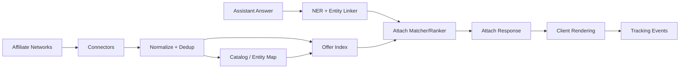

# Attach Layer Affiliate Link Aggregator Design

- Version: v0.1
- Last Updated: 2026-02-17
- Scope: `attach.post_answer_render` affiliate-link aggregation and lookup flow

## 1. Goal

Build an aggregator that:

1. Aggregates affiliate offers from multiple networks.
2. Uses NER/entity linking to detect commercial entities in assistant answers.
3. Returns the best matching affiliate link with low latency for post-answer rendering.

Rendering remains on client/app side; this module only returns attachment decisions and metadata.

## 2. Product Boundary

In scope:
1. Multi-network offer aggregation.
2. Entity extraction + canonical mapping.
3. Fast offer lookup + ranking.
4. Tracking link generation + response payload.

Out of scope:
1. UI rendering and visual style.
2. Conversation rewriting.
3. Next-step branch control.

## 3. End-to-End Flow

## 3.1 Runtime Flow (online)

1. Assistant finishes answer (`answer_completed`).
2. App sends `AttachQuery` with answer text + context.
3. NER service extracts entities and links to canonical catalog IDs.
4. Match service queries offer index by entity ID + locale/topic constraints.
5. Ranker scores candidates (`relevance`, `quality`, `bid`).
6. Aggregator returns attachable links/annotations.
7. App renders links and reports impression/click events.

## 3.2 Supply Flow (offline/nearline)

1. Pull offers from each affiliate network connector.
2. Normalize into unified offer schema.
3. Resolve merchant/product taxonomy and deduplicate.
4. Build searchable index (`entity_id`, locale, availability, score inputs).
5. Refresh index on schedule and push deltas.

## 4. Service Architecture

## 4.1 Core Components

1. `Connector Layer`
   - One connector per network (API/feed/csv).
2. `Normalization Pipeline`
   - Map raw network fields into unified schema.
3. `Catalog & Entity Resolver`
   - Canonical entity IDs (brand/product/service).
4. `Offer Index`
   - Low-latency lookup store for online matching.
5. `NER + Entity Linker`
   - Extract entities from answer text and map to catalog IDs.
6. `Attach Matcher/Ranker`
   - Eligibility filtering + ranking.
7. `Tracking/Attribution Service`
   - Generate click URLs and event attribution.

## 4.2 Logical Diagram

## 5. Data Contracts

## 5.1 Unified Offer Schema (internal)

Required fields:

1. `offer_id`
2. `network_id`
3. `target_url`
4. `tracking_template`
5. `entity_type` (`product|brand|service`)
6. `entity_canonical_id`
7. `title`
8. `locale`
9. `market`
10. `availability`
11. `quality_score`
12. `bid_value` (optional for non-bid networks)
13. `disclosure_label`
14. `updated_at`

## 5.2 Online Query Contract (proposed extension)

`AttachQuery`:

1. `appId`
2. `sessionId`
3. `placementId` (use `attach.post_answer_render`)
4. `context.query`
5. `context.answerText` (new)
6. `context.locale`
7. `context.intentScore`
8. `context.blockedTopics` (optional)

`AttachResponse`:

1. `requestId`
2. `placementId`
3. `attachments[]`
4. `attachments[].entityText`
5. `attachments[].entityCanonicalId`
6. `attachments[].targetUrl`
7. `attachments[].disclosure`
8. `attachments[].reason`
9. `attachments[].tracking` (`impressionUrl`, `clickUrl`)

## 6. Matching & Ranking Strategy

## 6.1 Eligibility Filters

1. Entity confidence >= threshold.
2. Topic not blocked.
3. Offer active and locale-compatible.
4. Frequency cap not violated.
5. Quality score above minimum.

## 6.2 Ranking Function (v1)

`final_score = w1*relevance + w2*quality + w3*bid + w4*historical_ctr`

Default priority:
1. Relevance first.
2. Quality second.
3. Commercial value third.

## 6.3 Result Limits

1. Max 1 attachment per entity.
2. Max N entities per answer (default 3).
3. Deterministic tie-breaker for reproducibility.

## 7. Latency and Reliability Targets

Online target for `AttachQuery`:

1. P50 <= 120ms
2. P95 <= 300ms
3. Timeout budget <= 450ms

Degradation policy:

1. Timeout => return empty attachments.
2. NER fail => fallback to no render.
3. Index stale => serve last known good snapshot.

## 8. Governance and Risk Controls

1. Sponsored disclosure must be explicit (`Sponsored`/`Affiliate`).
2. Sensitive verticals blocked by default (medical, finance advice, minors).
3. Full audit log for: trigger, candidates, ranking decision, returned offer.
4. No answer text rewriting in Attach layer.

## 9. Implementation Phases

## Phase A (MVP)

1. Integrate 1-2 affiliate networks.
2. Implement `attach.post_answer_render` only.
3. Basic NER + exact/fuzzy entity mapping.
4. Relevance-first ranking.

## Phase B

1. Add more connectors + dedup improvements.
2. Add quality score and dynamic weights.
3. Better fallback and observability dashboards.

## Phase C

1. Real-time bid-aware ranking.
2. Cross-network optimization.
3. Shared policy service for Attach + Next-Step layers.

## 10. Decisions Needed from Product

1. Initial vertical scope (electronics, travel, SaaS, etc.).
2. Default per-answer attachment cap.
3. Disclosure wording standard.
4. Billing start event (`click` only or `click + conversion`).
5. Whether to expose ranking weights to tenants.

