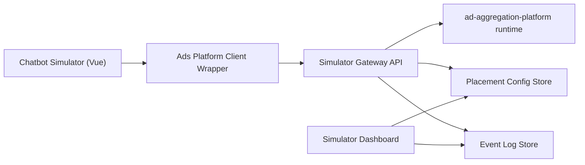
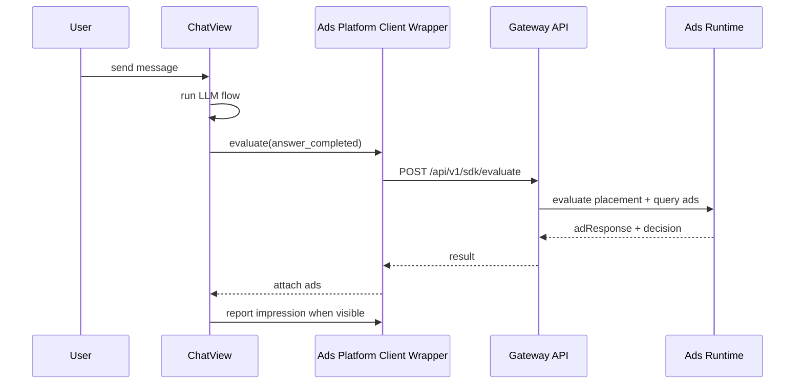

# Chatbot Simulator Ads Platform Client Integration Design

- Version: v0.1 (Draft)
- Last Updated: 2026-02-17
- Scope: `projects/simulator-chatbot` 如何接入广告平台官方 SDK client 与 Dashboard 配置体系

## 1. 目标

1. Simulator 在不破坏主对话体验的前提下接入广告平台官方 SDK client。
2. 接入方可在 Dashboard 修改 placement/trigger 参数并在 Simulator 生效。
3. 每次广告触发都可追踪到 requestId 与 decision reason。

## 2. 设计原则

1. `Fail-open`：广告链路失败不能阻塞主回答。
2. `Config-driven`：参数由用户配置，客户端只执行，不硬编码策略。
3. `Auditable`：每次决策都记录触发结果和原因。
4. `Layered`：attach / next_step / intervention 分层接入，逐层上线。

## 3. 推荐接入模式

推荐用于 Simulator 的模式：`Frontend + BFF Gateway`。



说明：

1. 前端不直接持有联盟密钥。
2. 广告聚合 runtime 在服务端执行。
3. Dashboard 改配置后，Gateway 提供最新配置给前端。

## 4. 与当前 Chat 流程的对齐点

当前主流程在 `ChatView.vue` 的 `handleSend()` 中完成：

1. 用户消息入列
2. 可选 web_search tool
3. LLM 流式输出
4. 回答完成后生成 follow-up

建议在不改主干结构的前提下，增加 3 个广告触发点：

1. `answer_completed`（Attach Layer）
- assistant 结束后，请求 `attach.post_answer_render`。
- 广告结果渲染在回答块后、Follow-up 前。

2. `followup_generation`（Next-Step Layer）
- follow-up 生成后，请求 `next_step.intent_card`。
- 结果渲染在 Follow-up Suggestions 下方。

3. `web_search_called`（Intervention Layer，后续）
- 先只打日志，不在 MVP 里启用渲染。

## 5. 建议新增模块（Simulator 侧）

建议新增以下文件，不直接把 SDK 逻辑塞进 `ChatView.vue`：

1. `src/api/adsPlatformClient.js`
- Simulator 侧 wrapper，仅调用官方 shared client：`ad-aggregation-platform/src/sdk/client.js`。
- 对外暴露 `runAttachPlacementFlow`、`runNextStepIntentCardPlacementFlow`、`reportAdsEvent`。

2. `src/sdk/intent-scoring.js`（可选）
- 生成 `intentScore`（MVP 可先启发式 + 关键词）。

3. `src/sdk/ads-decision-store.js`（可选）
- 存储当前会话广告决策与请求结果（便于 UI 和 trace）。

4. `src/components/SponsoredBlock.vue`
- Attach 广告展示组件。

5. `src/components/SponsoredNextStepCard.vue`
- Next-step 广告展示组件。

## 6. 消息数据模型扩展（建议）

在 assistant message 上新增：

```ts
interface MessageAdSlot {
  placementId: string
  requestId: string
  ads: Array<{
    adId: string
    title: string
    description?: string
    targetUrl: string
    disclosure: 'Sponsored' | 'Ad'
    reason: string
    sourceNetwork?: string
    tracking?: { clickUrl?: string }
  }>
  decision: {
    result: 'served' | 'blocked' | 'no_fill' | 'error'
    reason: 'served' | 'blocked' | 'no_fill' | 'error'
    reasonDetail?: string
    intentScore: number
  }
}

interface AssistantMessage {
  ...
  adSlots?: {
    attach?: MessageAdSlot[]
    nextStep?: MessageAdSlot[]
  }
}
```

## 7. 请求与事件时序



## 8. Gateway API 设计（MVP）

## 8.1 读取配置

1. `GET /api/v1/mediation/config?appId=...`
- 返回 placements 与 trigger 参数（来自 dashboard 配置）。

## 8.2 评估并拉广告

1. `POST /api/v1/sdk/evaluate`

请求示例：

```json
{
  "appId": "simulator-chatbot",
  "sessionId": "session_123",
  "turnId": "turn_001",
  "query": "best iphone deals",
  "answerText": "...",
  "intentScore": 0.72,
  "locale": "en-US"
}
```

响应示例：

```json
{
  "requestId": "adreq_xxx",
  "placementId": "chat_inline_v1",
  "decision": {
    "result": "served",
    "reason": "served",
    "reasonDetail": "runtime_eligible",
    "intentScore": 0.72
  },
  "ads": [
    {
      "adId": "a1",
      "title": "Offer",
      "description": "...",
      "targetUrl": "https://...",
      "disclosure": "Sponsored",
      "reason": "entity_match"
    }
  ]
}
```

## 8.3 事件上报

1. `POST /api/v1/sdk/events`
- Attach MVP 与 `evaluate` 使用同一最小字段：
1. `appId`
2. `sessionId`
3. `turnId`
4. `query`
5. `answerText`
6. `intentScore`
7. `locale`

## 8.4 MVP Frozen Contract (Attach Only)

For the current production-connect phase, freeze the official client contract to:

1. `placement = attach.post_answer_render` (server-side fixed)
2. `event = answer_completed` (server-side fixed)
3. `failure policy = fail-open`

Frozen request requirements:

1. `appId`
2. `sessionId`
3. `turnId`
4. `query`
5. `answerText`
6. `intentScore`
7. `locale`

Fail-open behavior (mandatory):

1. If `POST /api/v1/sdk/evaluate` fails or times out, chat response must continue without ad rendering.
2. Record trace event as `ads_evaluate_failed` with error code and latency.
3. Do not retry in blocking path; retry is allowed only in async telemetry path.

## 9. 与 Dashboard 的联动

Dashboard 的核心职责：

1. 改 placement 开关与优先级
2. 改 trigger 参数（用户自定义）
3. 看收益指标与决策日志

联动方式：

1. Gateway 每次 evaluate 前读取最新配置（可加短 TTL 缓存）。
2. 所有 decision/result/reason 进入日志存储。
3. Dashboard 基于日志与聚合数据渲染指标。

## 10. Trace 与可观测字段（必须）

在 `turnLogs` 里新增事件类型：

1. `ads_evaluate_started`
2. `ads_evaluate_completed`
3. `ads_served`
4. `ads_no_fill`
5. `ads_blocked`
6. `ads_event_reported`
7. `ads_event_report_failed`

每个事件建议包含：

1. `requestId`
2. `placementId`
3. `event`
4. `intentScore`
5. `decision.result`
6. `decision.reason`（枚举：`served/no_fill/blocked/error`）
7. `decision.reasonDetail`（可选，排障使用）

## 11. 容错与降级

1. Ads Platform Client/Gateway 超时：跳过广告渲染，主回答正常完成。
2. 参数异常：使用本地安全默认值（如 intentThreshold=0.8）。
3. no-fill：记录 `reason=no_offer`，不展示广告。
4. click 上报失败：不影响跳转，异步重试。

## 12. 分阶段实施计划

## Phase 1（1-2 天）

1. 在 Simulator 中接入 `adsPlatformClient`（先走 mock 返回）。
2. 完成 attach 与 next-step 的 UI 插槽。
3. 将广告事件写入 turn trace。

## Phase 2（2-4 天）

1. 新增 Gateway evaluate/events API。
2. Gateway 对接 `runAdsRetrievalPipeline`。
3. Dashboard 接入决策日志与配置读取。

## Phase 3（2-3 天）

1. 配置写入（PUT placement/trigger）+ schema 校验。
2. 新增变更审计与配置版本回滚。
3. 增加 AB 实验字段（可选）。

## 13. 上线门槛（Go-Live Gates）

本阶段上线前必须同时满足以下 3 条，不满足任一条即不可上线。

## 13.1 Gate A: 主回答不被阻塞

目标：
1. `answer_completed` 到 assistant 消息 `status=done` 的主链路不等待广告结果。

验收方式：
1. 在官方 client 正常、慢响应、超时三种场景各抽样 30 轮。
2. 对比“接入前基线”和“接入后”主回答完成时延（P50/P95）。

通过标准：
1. 主回答完成率不下降。
2. 主回答 P95 时延劣化 <= 5%。
3. 允许广告异步晚到，但不允许主回答卡住。

## 13.2 Gate B: 广告失败不影响聊天（Fail-open）

目标：
1. 当 `mediation/config`、`sdk/evaluate`、`sdk/events` 任一失败时，会话仍可继续。

验收方式：
1. 人为制造 Gateway 超时/5xx/网络中断。
2. 连续验证 20 轮对话，覆盖无广告、no-fill、error 三类返回。

通过标准：
1. 聊天可继续发送与接收，不出现“广告失败导致对话失败”。
2. Turn Trace 出现失败事件：`ads_config_fetch_failed` 或 `ads_evaluate_failed` 或 `ads_event_report_failed`。
3. 失败后不触发阻塞重试，仅允许异步上报重试。

## 13.3 Gate C: requestId 全链路可追踪

目标：
1. 每次 `served/no_fill/blocked/error` 都可追溯到唯一 `requestId`。

验收方式：
1. 从前端一次对话开始，抽取 20 个样本。
2. 逐条核对：Simulator Turn Trace -> Gateway decision logs -> Dashboard decisions。

通过标准：
1. 三端均能查询到同一 `requestId`。
2. `requestId` 对应的 `placementId`、`decision.result`、`decision.reason` 一致。
3. `served` 样本可追踪到至少一次事件上报记录。

## 13.4 旧验收项合并说明

以下既有 MVP 验收点保留，作为补充指标：
1. 一轮对话结束后可稳定返回 attach 广告或 no-fill 原因。
2. 点击广告可上报 click 事件并在 logs 可查。
3. Dashboard 修改阈值后，新对话 1 分钟内生效。

## 14. 当前建议的“先做清单”

1. 先完成 Phase 1（前端 adsPlatformClient wrapper + UI 插槽 + trace）。
2. 立即定义 Gateway `evaluate` 和 `events` 协议（即使先 mock）。
3. 用你已有的 Dashboard 原型先消费 decision logs mock，验证运营流程。

## 15. 无硬编码契约（接入方负担最小）

`Chatbot` 中不允许硬编码以下内容：

1. placement 列表与开关
2. intent 阈值、cooldown、frequency cap
3. 广告触发策略
4. 网关地址（生产环境）

统一做法：

1. 配置由 Gateway 下发（`GET /api/v1/mediation/config`）。
2. 前端只负责执行与渲染，不做策略常量固化。
3. 地址通过环境变量注入（`VITE_SIMULATOR_API_BASE_URL` / `SIMULATOR_API_PROXY_TARGET`）。

允许的唯一默认值（仅开发态）：

1. dev proxy 默认指向 `http://127.0.0.1:3100`。
   原因：降低本地启动成本，做到开箱即用；同时可通过环境变量覆盖，不写死到业务逻辑。
